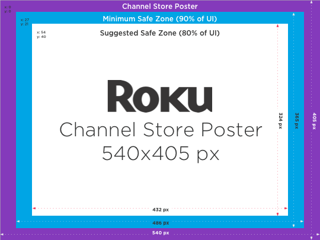
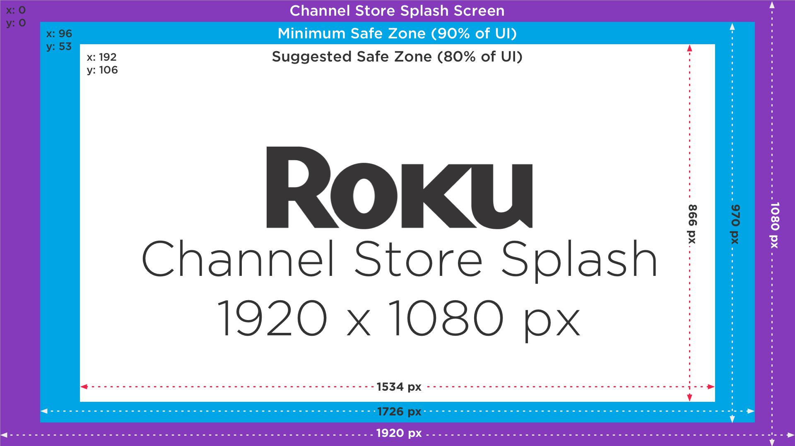
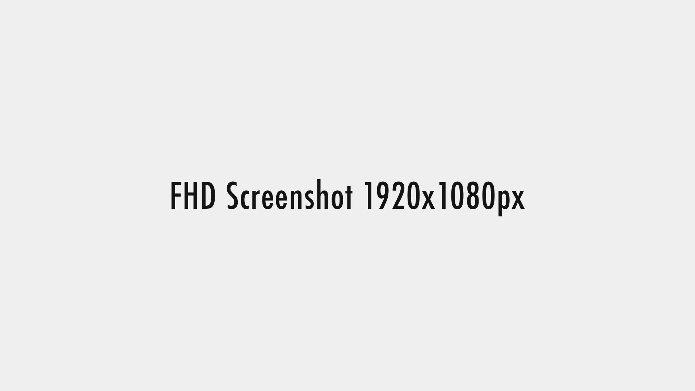
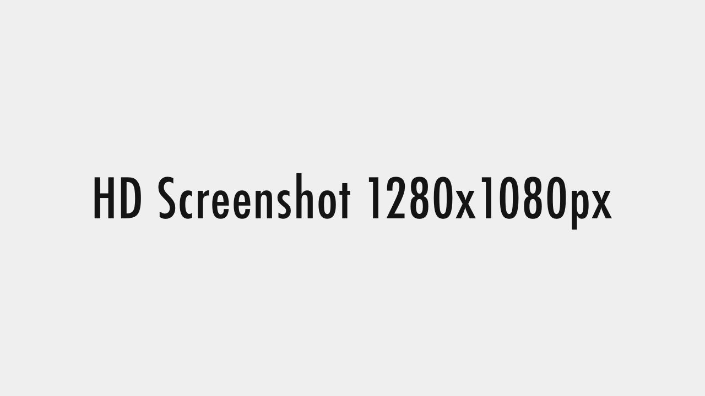

# Channel Artwork
The graphics that represent your product in the [Roku Channel Store](http://channelstore.roku.com) and our operating system, Roku OS.

### Overview
(add the overview of why these graphics are important here)

**Sections:**

1. [Channel Poster](#Channel-Poster)
2. [Channel Splash Screens](#Channel-Splash-Screens)
3. [Screenshots](#Screenshots)

- - -

## Channel Posters
Posters (_or channel icons)_ are images that are displayed on the Roku OS home screen along with meta deta for your channel. They are listed in the Channel Store and is visible on the Home Screen when installed.

## Channel Splash Screens
Splash screens are full size graphics displayed while the channel is loading from the Roku OS home screen. It's the first visual viewers will see as a channel completes rendering.

## Screenshots
When publishing a channel, make sure to upload screenshots for display in the Channel Store. You can upload up to 6 screenshots for all locales. the sizes are:
* HD (1280×720)
* FHD (1920×1080)

Refer to the [Channel Packaging Developer Tutorial](/develop/developer-tools/developer-settings.md#screenshot-utility) for instructions on how to take screenshots.

**Note:** For High Quality video capture of the UI, some designers choose to use El Gato game capture devices. [More info](https://www.elgato.com/en/gaming)

<table>
<tr>
  <th>Screenshots</th>
  <th>FHD</th>
  <th>HD</th>
</tr>
  <tr>
    <td>FileType</td>
    <td>JPG, PNG</td>
    <td>JPG, PNG</td>
  </tr>
  <tr>
    <td>Dimension</td>
    <td>1920x1280px</td>
    <td>1280x720px</td>
  </tr>
</table>

### Screenshot samples
**FHD Screenshot**

**HD Screenshot**

