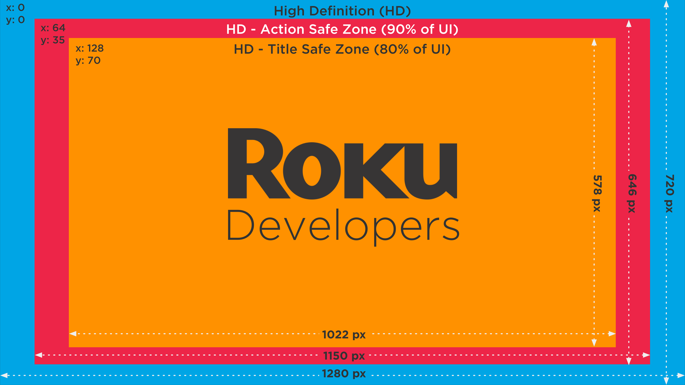
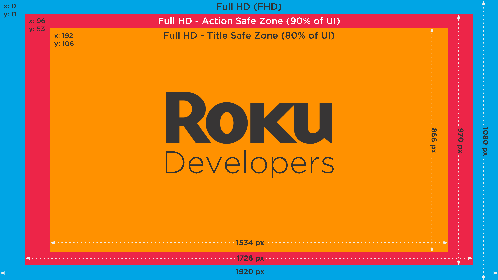
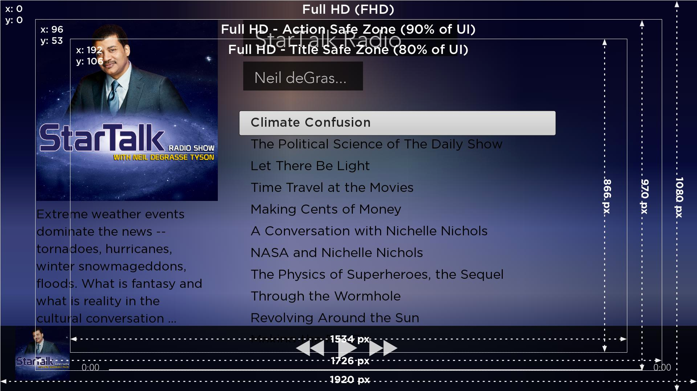

# Roku Channel Design / UX Best Practices

### Overview

Channels on the Roku platfom with a great user experience entertain and delight our shared audiences.  At the base, our mission is for the Roku platform to provide the best streaming experience for Television

#### Core principles for UX:
* **High expectations:** Consistently well-designed channels with value-add features reflecting insights into user needs and opportunities will make Roku the preferred entertainment choice, ensuring worthwhile fun.
* **Focus on content:** The best UI is an invisible UI that enables effortless accomplishment. Users don’t want to navigate - they want to discover, browse, recommend, bookmark and consume content.
* **Platform integration (“No Silos”):** Integration with the Roku platform boosts the visibility and the usefulness of your channel. Promotions, deep linking, presence in Roku search results and more are hallmarks of a well-integrated channel that makes best use of the Roku platform’s capabilities.  Ultimately, such integration drives increased channel usage, helping more users easily find and consume your content.


### Sections
0. [Safe Zones](#Safe-Zones)
1. [Navigation](#navigation)
2. [Presentation](#presentation)
3. [Content organization](#Content-organization)
4. [Performance](#Performance)
5. [Authorization and Authentication](#Authorization-and-Authentication)
6. [Audio and Video Playback](#Audio-and-Video-Playback)
7. [Trick Play](#Trick-Play)
8. [Options menus](#Options-menus)
9. [In-app Purchasing](#In-app-Purchasing)
10. [Deep Linking](#Deep-Linking)
11. [Channel Search](#Channel-Search)
12. [Channel Settings](#Channel-Settings)

- - -

## Safe Zones
Preparing for how various TVs render your channel requires an understanding of Title and Action "Safe Zones". These are the recommended areas to ensuring the edges of your TV screen do not cut off the interface.

HD Safe Zones  | FHD Safe Zones
:-------------------------:|:-------------------------:
  |  

We've also created a simple channel that shows these safe zones in action: https://github.com/rokudev/safe-zone-channel

### Title Safe Zone
Keep text that you intend the audience to read within the **Title Safe Zone - 80% scale of UI resolution**

* The FHD Title Safe Zone is 1534x866, offset from the upper left corner (0,0) by 192, 106.
* The HD Title Safe Zone is 1022X578, offset from the upper left corner (0,0) by 128,70.
* The SD Title Safe Zone is 576X384, offset from the upper left corner (0,0) by 72,48.

### Action Safe Zone
Keep important visual elements within the **Action Safe Zone**, content outside the Action Safe Zone risks being cut off by the edge of the screen - **90% scale of UI resolution**

* The FHD Action safe zone is 1726x970, offset from the upper left corner (0,0) by 96, 53.
* The HD Action safe zone is 1150X646, offset from the upper left corner (0,0) by 64,35.
* The SD Action safe zone is 648X432, offset from the upper left corner (0,0) by 36,24.

#### Tool: Safe Zones Overlay
To help developers with testing their titles and action spaces, we've created a simple function that overlays these screens on their channel. Great for UX testing on FHD and HD.

You can find the project at https://github.com/rokudev/safe-zone-overlay

_Here's a sample of the tool in action_

## Navigation

Best Practices  | Rationale / Benefits
--|--
Use the remote navigation buttons consistently within your channel. _See the Design Guidelines for detailed recommendations.._  |  Channel-wide UI consistency helps provide a seamless, content-focused user experience
Respect platform conventions and assign remote navigation button behavior consistent with the Roku system UI wherever applicable. _See the Design Guidelines for detailed recommendations.._  |  Again, system-wide UI consistency helps provide a seamless, content-focused user experience.
Strive for “minimum clicks to consumption”.  Make it trivial for users to find and watch what they want.  |  Users want to watch videos, not navigate the UI.  Fast access to content delights users and increases time spent in a channel.

## Presentation

 Best Practice 	| Rationale / Benefits
----|-------
 Design your application to work in both 4:3 and 16:9 TV formats. 	| Users select their display types using the Roku Settings menu, which includes only formats that their player model will support.  Designing your application to work in SD and HD formats ensures that it can be optimally displayed on any Roku player. _For more information, see the Roku Design Guidelines._
 Strive to provide graphics for every “thumbnail” and preview image in your channel. 	| Content graphics help users make faster decisions around what to watch. They’re also visually interesting and fun to browse.
 Ensure that all active UI has sufficient contrast to make it readable in sunny environments. 	| Without sufficient contrast, users will have trouble correctly reading screens and using your channel.  Most applicable to channels with custom UI.
 Strive to push timely updates to your channel for any 2nd screen events that update user data: purchases, rentals, watch / history list updates, and so on. 	| Data that is out of sync across screens confuses users and can erode trust in the system. _Good synchronization is a nice touch that builds user trust in your channel_

## Content organization

Best Practice | Rationale / Benefits
----|----
Provide audience-focused editorial categories, both automated (Top Stories, New This Week…) and curated (Critics’ Picks, <genre> Classics…) on or directly under your Channel Home. | Catering to your users with content organized “their way” delights them, builds loyalty and increases use over time.
Don’t just imitate or force fit information architecture from any second screens your channel may utilize (e.g. Web, mobile…)  Instead, optimize for the 10-foot “On Roku” consumption experience, including platform standards and design conventions, wherever possible. | Content is king; finding, discovering, browsing and watching it should be as friction free as possible to give your channel’s users a Best On Roku experience.
Tag your content so that it will appear as appropriate during search, discovery, deep linking, and recommendation activities. | Properly tagged content is able to be utilized in and out of your channel, not only for ease of discovery and location but also for alignment with user expectations.  For example, if a user likes show X, Roku’s recommendation for “You might also like A, B and C” should be as accurate and relevant as possible.


## Performance

Best Practice | Rationale / Benefits
---|---
Optimize your channel code to provide smooth transitions and animations | Jerky or blocky transitions erode the seamlessness of the Roku user experience and feel unfinished or “broken” to users.
Minimize perceived latency by providing active feedback during all operations that may take longer than a second to complete. | Keeping users entertained and informed during routine time-intensive operations like video buffering and channel loading gives the illusion of added performance, and positively impacts users’ perception of channel quality.

## Authorization and Authentication

Best Practice | Rationale / Benefits
---|---
Optimize your channel code to provide smooth transitions and animations | Jerky or blocky transitions erode the seamlessness of the Roku user experience and feel unfinished or “broken” to users.
Minimize perceived latency by providing active feedback during all operations that may take longer than a second to complete. | Keeping users entertained and informed during routine time-intensive operations like video buffering and channel loading gives the illusion of added performance, and positively impacts users’ perception of channel quality.


## Audio and Video Playback

Best Practice | Rationale / Benefits
---|---
For ad-supported channels: When presenting mid-roll ads, strive to insert the ads into scene cuts rather than randomly. | Seamless content presentation is as important as seamless UI navigation.  A cut to commercial in the middle of a dialogue or a climactic scene disrupts the entertainment flow and annoys users.
For ad-supported channels: Consider front-loading ads in pre roll to minimize interruption of videos. | Fewer content interruptions mean happier users.
For ad-supported channels: Consider not increasing the frequency of mid-roll ads as users progress through content. | From a business perspective this policy makes sense. Users who have invested time and attention into a show are a more captive ad audience. More importantly, from a user perspective it is very intrusive and frustrating to see more and more ads as a story is reaching its conclusion.  You will “win the battle, but lose the war” as users seek entertainment elsewhere.

## Trick Play?

Best Practice | Rationale / Benefits
---|---
Stuff | Other stuff


## Options menus

Best Practice | Rationale / Benefits
---|---
“Search (channel name)” is recommended as a global option if your channel supports in-app Search. | Users may decide to find another piece of content at any time. Providing Search globally prevents users from having to navigate to a Search jumping-off point within your channel UI.
“(channel name) Home” is recommended as a global option. | Users may want to restart their browsing, or locate a specific content item or category from memory, at any time.  This option enables that behavior. Adding the channel name ensures that users do not confuse this option with the Roku Home screen.
Strive to limit the Options menu to no more than 4 local options and 2 global options. | Stuffing the Option menu with too many choices slows down users’ interaction with your channel UI and goes against Roku’s core principle of simplicity. If you find that there are too many features in your Options menus, consider refactoring your channel’s UI or removing features not essential to your channel experience on the Roku platform.

## In-app Purchasing

Best Practice | Rationale / Benefits
---|---
Provide clear pricing for any and all purchase options prior to entering Purchase workflow | Simply put, users want to know prices before buying.  Not providing this information will have a direct negative impact on sell-through.

## Deep Linking

Best Practice | Rationale / Benefits
---|---
Consider providing appropriate metadata to support deep linking (ads, Roku Search…) | Deep linking gives users another way to discover your channel, increasing content consumption and time spent in your channel.

## Search

Best Practice | Rationale / Benefits
---|---
Support incremental search (refresh results as characters are input) | Incremental search is becoming a de facto standard - users expect to see results from partial searches without waiting.  This behavior makes Search more efficient and reduces the friction between UI interaction and content consumption.
If your channel supports Search, provide one Search entry point in the Home screen of your channel and (optionally) one in the “global” section of your channel’s Options menus. | To users, Search is not a channel specific behavior (though they may expect channel specific results).  Making this consistent everywhere allows users to leverage learned behavior in your channel, again removing friction in regular use.


## Channel Settings

Best Practice | Rationale / Benefits
---|---
If your channel supports Settings, it’s recommended to provide a single entry point in the Options dialog of your Home screen. | Settings are rarely used, and do not belong in primary UI such as the Home screen of your channel.
If your channel supports Settings, follow the Roku platform model: a flat Settings screen with one click access to specific sub screens. | Following the platform interaction model means that there is no need for users to learn additional layout or navigation behaviors.
