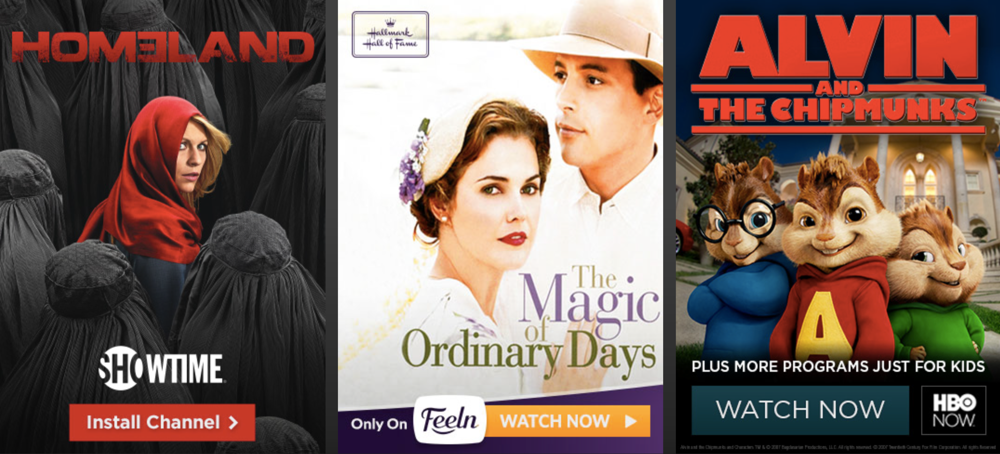
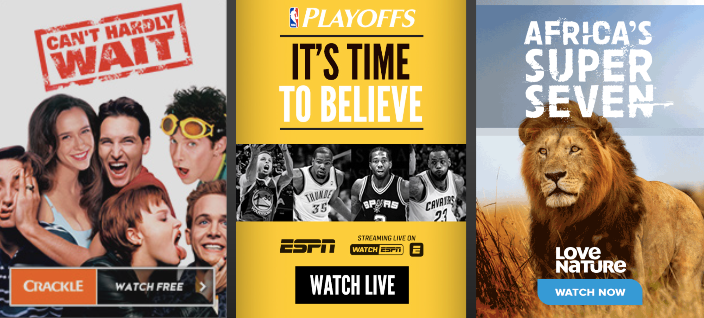

# Roku Display Ads
_Details and specifications for our Home Screen ad banners._

### Overview
Roku provides an effective and unique advertising platform allowing brands to engage with captive audiences via the largest in-home screen. At Roku’s core, we strive to connect consumers with content that interests and engages them, and advertising on Roku must uphold this same principal.

The advertising requirements within this document were established to ensure that ads feel authentic to the overall Roku experience and are always grounded in entertainment.

**Sections**
* [Roku Brand Philosophy](#Roku-Brand-Philosophy)
* [Ad Creative Requirements](#Ad-Creative-Requirements)
* [Creative Examples](#Creative-Examples)

- - -

### Roku Brand Philosophy
We’re constantly looking at ways to give consumers the best TV experience. We believe that they should be in control of what they watch and how much they pay, from subscription services, to renting the latest releases, to making cable TV even better. In other words, we deliver "TV on your terms.""

#### "NOW THIS IS TV&#8482;"
These three brand pillars represent what matters most to us.

<table>
  <tr>
    <th>Most Entertainment </th>
    <th>TV on your terms</th>
    <th>Easiest to User </th>
  </tr>
  <tr>
    <td>Roku brings people together to celebrate content. And "content" doesn't just mean movies and TV shows – we have something for everyone, from yoga, to dance party playlists, to courses for learning a new language.   Our on-device ads are vital to helping our viewers find and enjoy great videos. Using a content-first approach, advertising should be a way consumers are introduced to entertainment they'll love.</td>
    <td>With Roku, consumers have the freedom of choice. Roku's open platform allows content to be quickly added, which means consumers get more value from and control over the entertainment they watch.   Our advertising further extends this freedom. Our ads are attention-grabbing yet unobtrusive and native to the overall Roku experience, so consumers always know they have a choice whether or not to engage.</td>
    <td>Everything Roku builds, from our remote to our search capabilities, is centered around simplicity for the end user.  Similarly, our ads are simple, clear and intuitive so our viewers know what they're gettingwhen they click.</td>
  </tr>
</table>

## Ad Creative Requirements
All display advertising on Roku must provide value to the consumer and not distract from the TV experience. To help channels do just that, we’ve put together a few concrete rules that will elevate your creative to the high standard the Roku viewer has come to expect.

### Writing Style: Headlines and CTAs
When crafting messaging, strive to be:
* **Transparent.** Are you clearly describing your offer? Don’t hide behind colorful language – be open and honest.
* **Enthusiastic. **Show excitement! TV, movies and entertainment are fun; advertising can be, too.
* **Approachable.** Is your message welcoming, or is it pushy? We want to connect consumers with great content, not push products/sales.

<table>
  <tr>
    <th>DO</th>
    <th>_DON'T_</th>
  </tr>
  <tr>
    <td>Be straightforward – no click bait. What’s the offer? Tell consumers.</td>
    <td>Bury the lead. Brand taglines are not headlines. They don’t offer viewers a clear picture of the content they’ll be receiving.</td>
  </tr>
  <tr>
    <td>Keep the tone friendly, but be action-oriented.</td>
    <td>Use language that's not necessary or appropriate for the medium. For example, Roku devices _are_ digital and HD – we don’t need to reiterate these inherent qualities on creative.</td>
  </tr>
  <tr>
    <td>Be concise and make it scan-able. If it requires work, it’s not worth reading.</td>
    <td>Drown in copy. Using 20% of the banner for copy (excluding the CTA) is a good rule of thumb.</td>
  </tr>
  <tr>
    <td>Call To Action's **must** be one of the following:   Watch, Now, Watch Free, Watch Video, Install Channel, Learn More, Get Credit</td>
    <td>Be clever at the expense of clarity.</td>
  </tr>
</table>

### Imagery: Content Focus
When selecting imagery, aim to be:
* **Immersive.** Get close. Draw consumers in and make them want to learn more.
* **Evocative.** Move consumers. Pick images that bring forth an emotional connection.
* **Unique:** Think "special." Unique perspectives or limited-edition imagery offer value.

<table>
  <tr>
    <th>DO</th>
    <th>_DON'T_</th>
  </tr>
  <tr>
    <td>Be bold. Show action, motion and emotion.</td>
    <td>Have your channel be the center of attention. Content is king!</td>
  </tr>
  <tr>
    <td>Use recognizable entertainment to your advantage: imagery focusing on well-known actors, channels or titles perform well.</td>
    <td>Have more than one focal point. The viewer’s attention should be on the main message. We advise against mosaics/collages.</td>
  </tr>
  <tr>
    <td>Avoid dead space. Roku is the largest in-home advertising canvas! Devote at least half the banner space to eye-catching imagery.</td>
    <td>Box out the entertainment. Avoid borders and banners.</td>
  </tr>
  <tr>
    <td>Keep it G-rated for a daytime airing. After 8 pm, PG is allowed.</td>
    <td>Be stingy. Full-bleed imagery is beautiful and compelling. Use it!</td>
  </tr>
</table>

### Best-In-Class Creative
Take a look at some examples of banner advertising that’s resonated with the Roku audience.

## Display Ad Specs
All images and/or questions can be submitted to [adcreative@roku.com](mailto:adcreative@roku.com)

Final, approved creative is due 2 full business days before campaign launch.

<table>
<tr>
  <th>Ad Specs</th>
  <th>4K</th>
  <th>HD</th>
  <th>SD</th>
</tr>
  <tr>
    <td>FileType</td>
    <td>JPG, PNG</td>
    <td>JPG, PNG</td>
    <td>JPG, PNG</td>
  </tr>
  <tr>
    <td>Banner Dimension</td>
    <td>525x735px</td>
    <td>350x490px</td>
    <td>200x280px</td>
  </tr>
  <tr>
    <td>Min. Font Size</td>
    <td>33px</td>
    <td>23px</td>
    <td>13px</td>
  </tr>
  <tr>
    <td>Image Colors</td>
    <td>rgb(235,235,235) _to_ rgb(16,16,16)</td>
    <td>rgb(235,235,235) _to_ rgb(16,16,16)</td>
    <td>rgb(235,235,235) _to_ rgb(16,16,16)</td>
  </tr>
  <tr>
    <td>Text Colors</td>
    <td>On light: #101010 On dark: #ebebeb</td>
    <td>On light: #101010 On dark: #ebebeb</td>
    <td>On light: #101010 On dark: #ebebeb</td>
  </tr>
  <tr>
    <td>Max File Size</td>
    <td>150 kB</td>
    <td>100 kB</td>
    <td>100 kB</td>
  </tr>
  <tr>
    <td>Deep links</td>
    <td>_Required_</td>
    <td>_Required_</td>
    <td>_Required_</td>
  </tr>
  <tr>
    <td>Samples</td>
    <td></td>
    <td></td>
    <td></td>
  </tr>
</table>

**Additional details for Ad specs:**
* **Image formats:** Use .jpg for ads without transparency and .png graphics for ads with transparency
* **Image colors:** Avoid pure white backgrounds – use #ebebeb Avoid pure reds, they bleed
* **Deep links:** Deep Linking required. Banners promoting content MUST be linked to content. [Learn more about deep links](/docs/develop/guides/deep-linking.md)

## Learn more
For more details on promotions, display ads, and growing your viewership, go to https://www.roku.com/advertising
