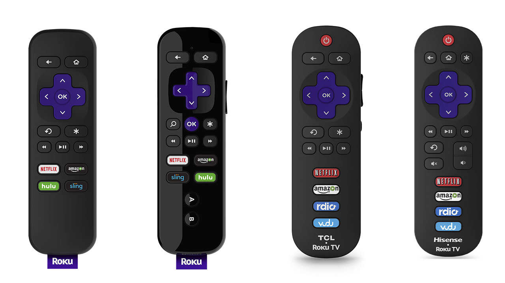
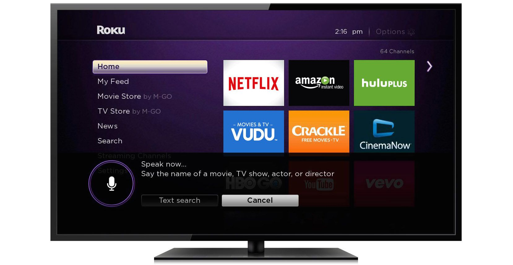
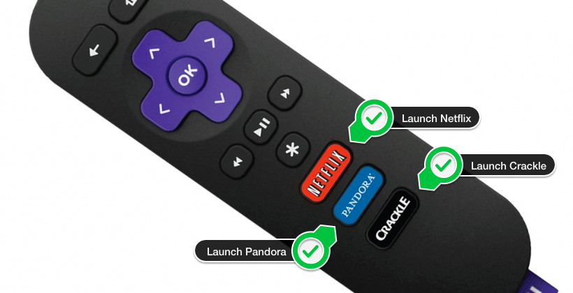

# Roku Remote
The main tool for interaction on Roku OS is the Roku Remote.

### Overview
The Roku Remote is packed with features that enable viewers to quickly find and watch their favorite content. In addition it enables game developers to provide a playing experience for their audience. The following lays out the expected behavoir of remotes and what customers for UX.

**Sections:**

1. [Remote controls](#remote-controls)
2. [Buttons](#buttons)
3. [Voice](#voice)
4. [Quick launch channels](#Quick-launch-channels)
5. [Game controls](#Game-controls)

- - -

## Remote controls
When building Channels on the Roku platform, it's critical to keep in mind the multiple options for Roku devices and various remote controls that run your products.

### Enhanced Remotes
Some Roku devices are able to control the volume settings, instant replay, motion, and voice activated search. In addition, a major feature of select Roku remotes is private listening, which enables viewers to plug in headphones and listen to the channels in real time.

## Buttons

### General controls
Button  | Description  |  Expected behavoir
:--|---|--:
:house:  |  Home |  Return to Roku home screen
:arrow_left:  |  Return/Back | Return to the previous screen
:star: | Options | Varies between options, settings &amp; help screens

### Directional pad controls
Also know as the 'd-pad', the direction pad is meant for navigation through the UI.

Button  | Description  |  Expected behavoir
:--|---|--:
:ok: |  OK |  Select an option from menu
:arrow_up_small: | Up | Move up
:arrow_down_small:  |  Right |  Move right or skip forward
:arrow_backward:  |  Left |  Move left or skip backwards
:arrow_down_small:  |  Down |  Move down

### Playback
Button  | Description  |  Expected behavoir
:--|---|--:
:arrow_forward:  |  Play/Pause |  Start or pause playback
:rewind: | Rewind | Rewind, scroll left one page at a time
:fast_forward:  |  Fast Forward | Fast forward, scroll right one page at a time

### Enhanced remote
Button | Description | Expected behavoir
:--|---|--:
:headphones: | Headphone port | Activate private listening
:a: | A button | For gaming functionality
:b: | B button | For gaming functionality
:repeat: | Instant Replay | Replay last 7 seconds of video
:mag_right: | Search | Activates Voice Search

### Roku TVs additional controls
Depending on the exact model of Roku TV, these are additional controls available to viewers:

Button | Description | Expected behavoir
:--|---|--:
:mute: | Mute | Mute the volume
:sound: | Volume down | Reduce the current volume
::loudspeaker:: | Volume up | Increase the current volume
:moon: | Display Sleep | Sleep timer
:clock12: | Power | Turn on/off Roku TV
:video_game: | Game mode | Increase TV refresh rate

## Voice
Pressing the :mag_right: Search button triggers the search interface. Some Roku remotes have audio input and will process the search results on screen. Text base search is a secondary option.

## Quick launch channels
Select channel partners have quick launch buttons from the Roku remote itself. They are self-descriptive buttons for launching a channel deep link.

## Game controls
Some remote controls have the ability to use motion. In addition, select remotes have programmable :a: and :b: buttons for developers to take advantage.

For full details on our External Control Protocal and building your own remotes, review our [ECP docs](/docs/develop/guides/remote-api-ecp.md)

#### Related resources:
* ECP guide
* Buy a replacement remote
* etc
