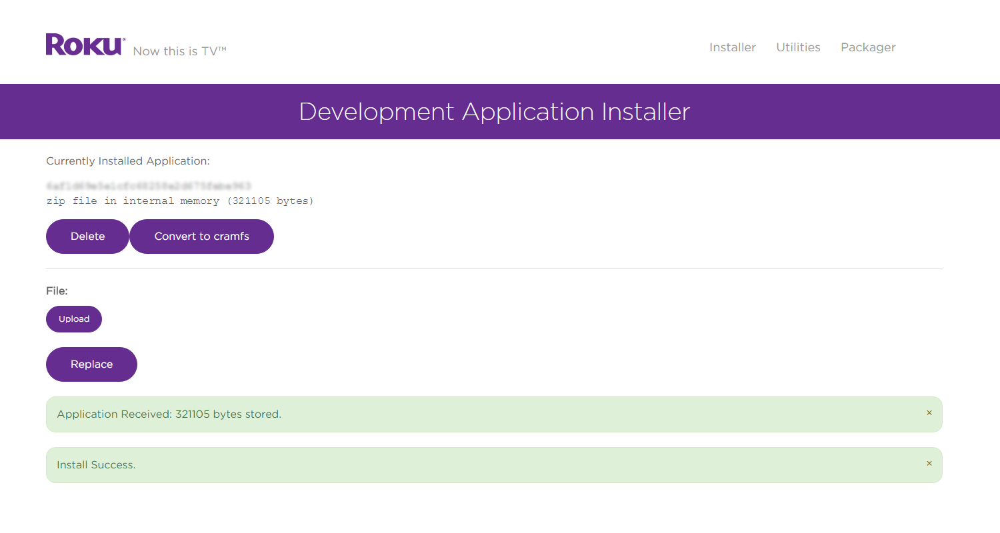
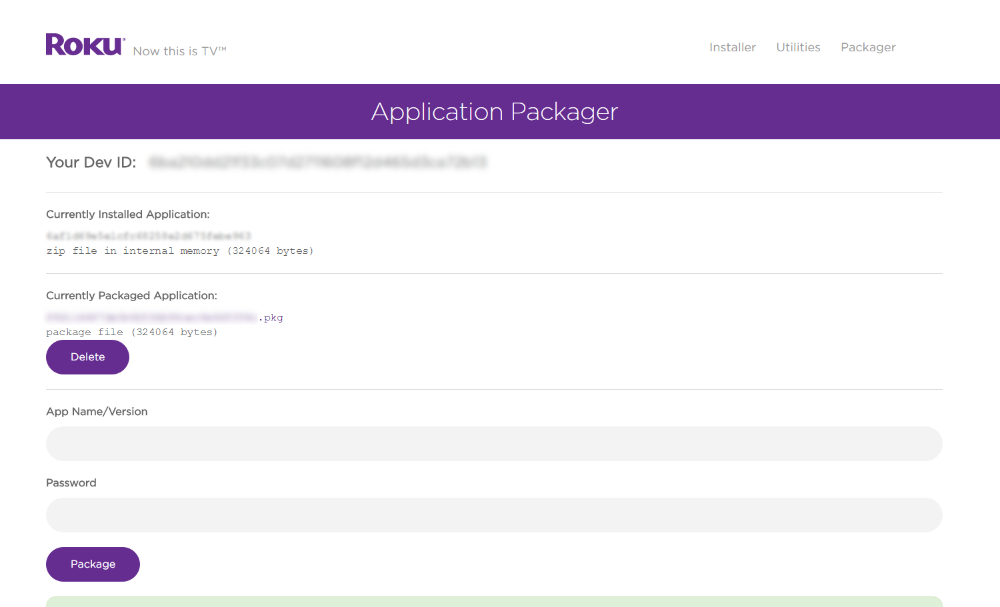

# Developer Settings

## Overview

Developer Settings contains a host of essential tools for Roku channel development such as:

* [Installing or "side-loading" channels](#application-installer)
* [Utilities to rekey a Roku device and take screenshots](#utilities)
* [Packaging channels for publication to the Channel Store](#application-packager)

Before these tools are available, a Roku device must have Developer Settings enabled.

Refer to the [Setup Guide](/develop/getting-started/setup-guide.md) for a step-by-step process.

## Application Installer

One of the most useful tools in Developer Settings is the Package Installer. This enables installing or "side-loading" a channel directly to a Roku device to test and QA before submitting for publication.

Refer to the [Hello World](/develop/getting-started/hello-world.md) guide for a step-by-step process on installing a channel using the Package Installer.

## Utilities

Several utilties are provided in Developer Settings:

* [Package Inspector](#package-inspector)
* [Rekey Utility](#rekey-utility)
* [Screenshot Utility](#screenshot-utility)

### Package Inspector

The package inspector is a utility to inspect the details of the package such as the developer ID used and the creation date. This is helpful for verifying the same developer ID is used when updating a package to ensure any channel registry data remains intact.

Channel registry data will be lost when using a different developer ID to update a published channel.

### Rekey Utility

The rekey utility allows you to replace the signing key on the current Roku device with a key from an existing package. This utility is most useful when developing multiple channels on the same Roku device.

Refer to the [Channel Packaging](/develop/guides/packaging.md#rekeying) guide for a step-by-step process on rekeying a Roku device.

### Screenshot Utility

The screenshot utility enables developers to capture images of sideloaded channels. These images can be uploaded with a channel submission to showcase in the Channel Store after publication.

To take a screenshot:

* Side-load a channel
* Navigate to the screen that needs to be captured
* Click on the screenshot button

_Note: Screenshots will only work for sideloaded channels and static content (i.e. screenshots of video will not work). FHD (1920x1080) screenshots also require a 4K capable Roku set to 1080p or 4K UHD display type._

## Application Packager

The application packager takes the side-loaded channel and signs and generates an encrypted package for publication.

This enables developers to securely publish channels while keeping all intellectual property safely encrypted. The process of “packaging a channel” uses cryptographic hardware built into Roku devices and creates an encrypted package that can be easily and securely distributed on Roku devices.

For a step-by-step walkthrough, see the guide on [Channel Packaging](/develop/guides/packaging.md).
