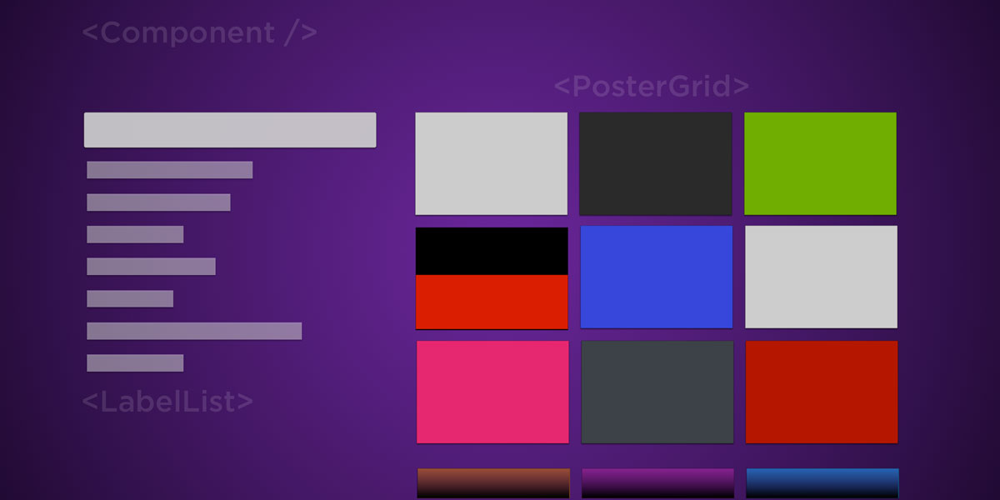

# Getting Started
_The first steps to launching a channel on the Roku Platform_

Roku pioneered streaming for the TV, and we aspire to power every TV in the world. As an open streaming platform, we welcome developers from around the world to grow their audience with Roku.

In addition, Roku OS is purpose-built for the TV and runs across Roku streaming players, Roku TV™ models, and Roku Powered™ players. Build, publish, and monetize your channel applications on the Roku platform.

##  Resources for getting started

The following guides will show how to get up and running quickly:

1. Review the guide on [How Roku Channels Work](/develop/getting-started/how-channels-work.md), which covers hosting, developers, and building channels on the Roku Platform.

2. The [Developer Setup Guide](/develop/getting-started/setup-guide.md) covers the steps required in activating developer settings on a Roku device in addition to enrolling your Roku account in the Developer Program.

3. Our introductory [Hello World Tutorial](/develop/getting-started/hello-world.md) offers a downloadable sample application for developing on the Roku Platform.

4. Our latest [sample Roku channels](/rokudev/sample-channels) and [tutorials](/develop/guides) cover how to integrate essential features into your channels.
