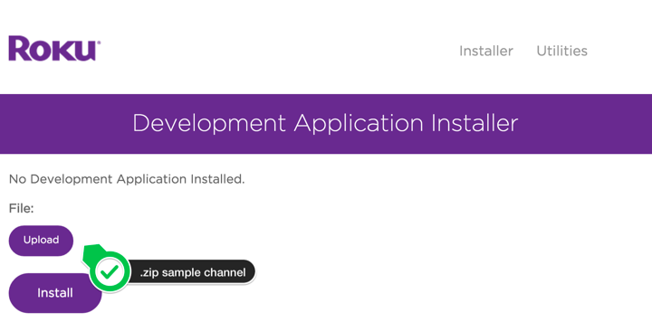
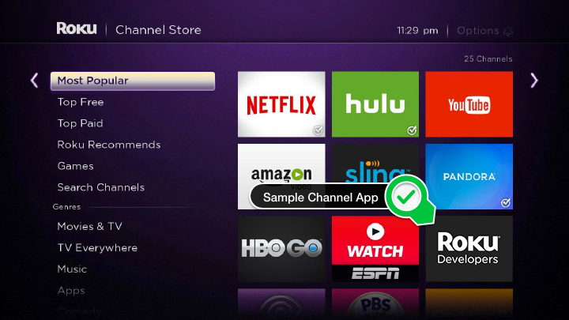
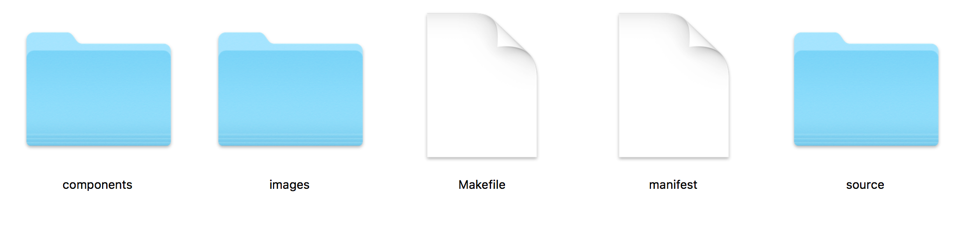
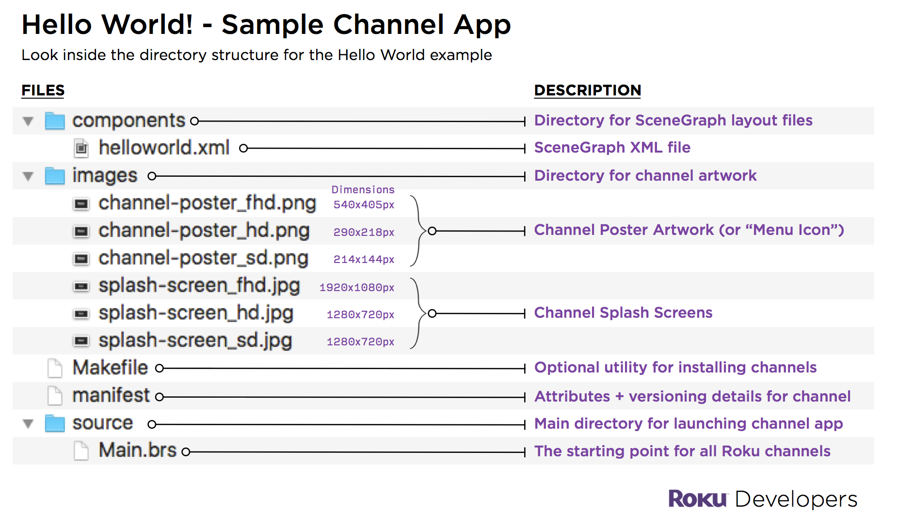
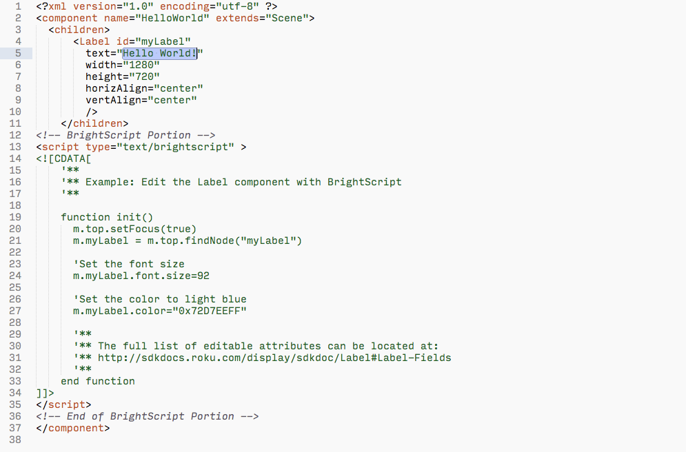
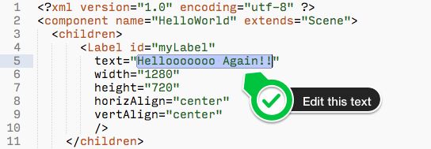
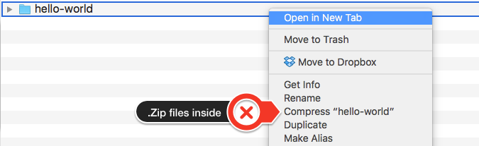
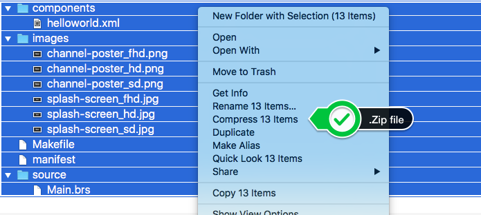
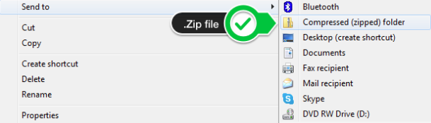
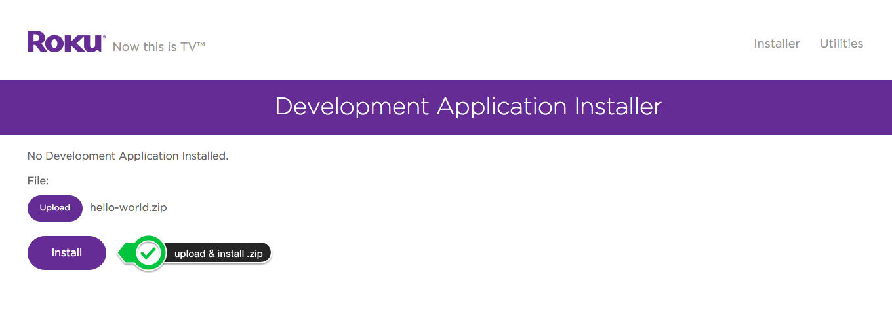

# Hello World

_How to load a sample channel application on your Roku device_

### Overview

In this guide, we will cover the essential steps for installing and modifying a ‘Hello World’ sample channel application on your Roku device.

**Steps:**

1. Review the [**Developer Setup Guide**](/develop/getting-started/setup-guide.md)
2. Open the Developer Application Installer
3. [**Download**](https://github.com/rokudev/hello-world/raw/master/dist/apps/hello-world.zip) and install the Sample Channel Application
4. Edit the Sample Channel Application
5. Re-upload the Sample Channel onto a Roku device

**Requirements to follow this guide:**

* A Roku device: [roku.com/products/compare](https://www.roku.com/products/compare)
* A Roku developer account: [developer.roku.com/enrollment/standard/](https://developer.roku.com/enrollment/standard/)
* Download the sample channel application: [hello-world.zip](/rokudev/hello-world/raw/master/dist/apps/hello-world.zip)

---

## 1. Review the [Developer Setup Guide](/develop/getting-started/setup-guide.md)

The Roku Developer Setup guide enables any Roku device to install sample applications such as the basic hello world example in this guide.

**Developer Settings**         |  **Development Application Installer**
:-------------------------:|:-------------------------:
 |  

## 2. Open the Development Application Installer

After completing the steps covered in the [Developer Setup Guide](/develop/getting-started/setup-guide.md), open a web browser and navigate to the Roku device URL _(i.e. http://192.168.x.x)_

**Note:** To connect to your Roku device, make sure your computer and Roku are on the same local network.

**Roku device credentials**

When you navigate to your Roku device, it will prompt for a **user name** (`rokudev`) and the password that was setup during the Developer Setup Guide. Enter this information to continue.

**Once the page opens, you have successfully connected to the Roku device.**

The main screen will show the development application installer:

_**Related article:**_ [How to update the software on a Roku device](https://support.roku.com/hc/en-us/articles/208755668-How-can-I-update-the-software-on-my-Roku-player)

<<<<<<< HEAD
## 3. Download and Install the Sample Channel Application
=======
**_Related guide:_**
[_How to update the software on a Roku device_](https://support.roku.com/article/208755668-how-can-i-update-the-software-on-my-roku-player)
<<<<<<< Updated upstream
=======
>>>>>>> origin/master
>>>>>>> Stashed changes

Now that you have enabled **Developer Settings** on your Roku device and logged in, we can continue with downloading and installing a Sample Channel Application.

**Download the sample application:** [hello-world.zip](/rokudev/hello-world/raw/master/dist/apps/hello-world.zip)

Once downloaded, take the `.zip` and upload it to your Roku device using the Developer Application Installer:

To finish this process, click on the **Install** button located below the upload option.

If the sample channel contains no errors and the process runs successfully, the sample channel will launch on the Roku device:

**Note:** Roku devices with **Developer Settings enabled** will allow one “side-loaded” channel at a time. If you run this process again, the new channel upload will replace the existing channel.

**Finding your Sample Channel on the Roku Device**

The side-loaded channel will be automatically placed in the bottom row of your main channels, also known as “My Channels”.

## 4. Editing the Sample Application
When you uncompress the `.zip` directory, you’ll see the following setup:

**Here’s a breakdown of the common items inside the sample application:**

For this example, you will open the [`helloworld.xml`](/rokudev/hello-world/blob/master/source/components/helloworld.xml) file that is located inside the `components` directory.

### helloworld.xml

The example XML file above shows how a simple `Label` is created and centered on the screen. Specifically on [line 5](/rokudev/hello-world/blob/master/source/components/helloworld.xml#L5), the `Label’s` value is set with `text="Hello World!"`.

_**Optional:** Review the code for additional attributes that can be set for this sample channel application._

Change the value of the text field on line 5 to another phrase:

After saving the edits to [`helloworld.xml`](/rokudev/hello-world/blob/master/source/components/helloworld.xml), select all the items inside the directory and use the zip compress utility on your computer.

### Compressing the contents of the Hello World directory

**Note:** Remember to compress only the contents of the directory, not the parent folder.

**For Example:**

If you compress (“zip”) the parent folder, the Developer Application Installer will return an error.

**The proper ways to compress the required files:**

**Mac OS X:**

Right click all selected files to compress into a `.zip` file.

**Windows:**

Simply select all the files and folders and right click to compress into a `.zip` file.

### Re-Upload the Channel Application

Once you have recompressed the Channel application, open a web browser and navigate again to the Roku device URL _(i.e. http://192.168.x.x)_

Upload the `.zip` file and click **Install**

You will immediately see the edited phrase in your Sample Channel Application:

## 5. Explore the Developer docs!

<<<<<<< HEAD
Go to [sdkdocs.roku.com](https://sdkdocs.roku.com/) and explore the methods, parameters, and syntax for building rich and complex channel applications on the Roku Platform.

<<<<<<< Updated upstream
For a more in depth look at building a channel from start to finish, check out the [SDK Development Guide](/develop/sdk-development) and learn how to setup a project, parse a content feed, build a UI, and how to play content.

For samples regarding our new XML framework, Roku SceneGraph, go to [Channel Samples Gallery](/develop/guides/) to get started!
=======
For Roku SceneGraph, check out the [samples](/rokudev/sample-channels) and [tutorials](/develop/guides)!
=======
For a more in depth look at building a channel from start to finish, check out the [SDK Development Guide](/develop/sdk-development) and learn how to setup a project, parse a content feed, build a UI, and how to play content.

For samples regarding our new XML framework, Roku SceneGraph, go to [Channel Samples Gallery](/develop/guides/) to get started!
>>>>>>> origin/master
>>>>>>> Stashed changes
