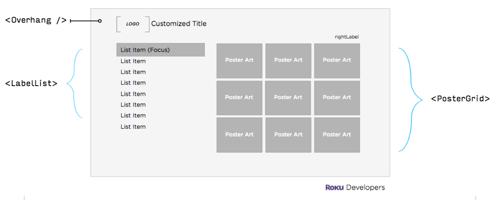
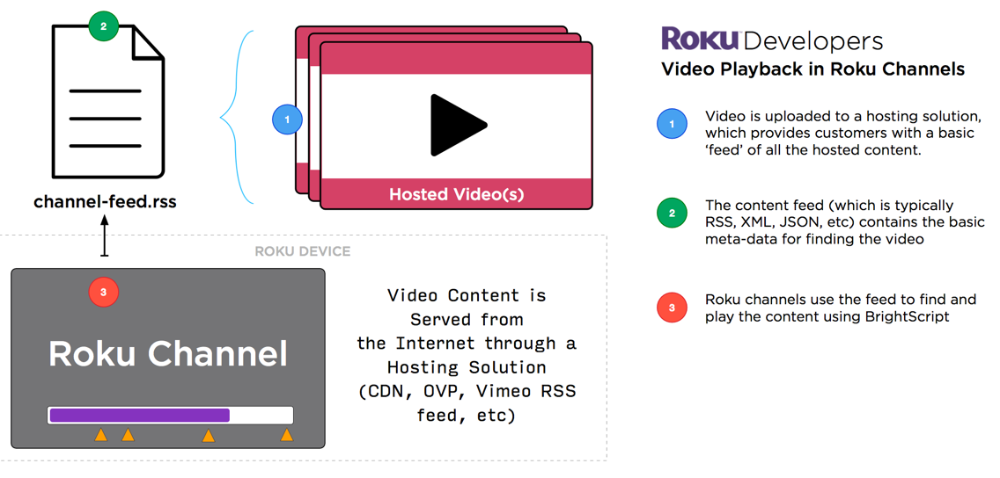
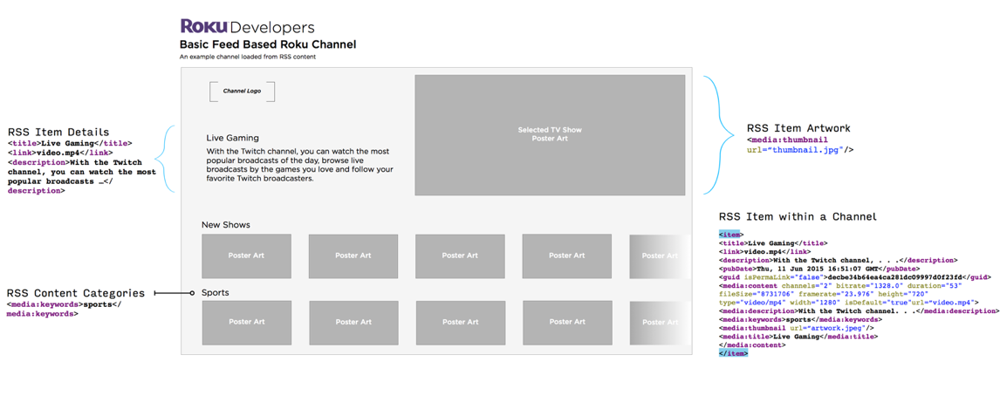

# How Roku Channels Work
Understand hosting, streaming, and building channels on the Roku Platform

### Overview

The Roku platform has thousands of channels, streaming over 5.5 billion hours of content to our audience in 2015\. As the industry leader in streaming devices and channel offerings, it’s helpful to understand how a Roku channel is developed and distributed to users around the world.

**The main requirements for creating a Roku Channel are:**

*   Original and/or licensed video content (content publishers)
*   Hosted content available through the Internet (OVP, CDN, etc)
*   Roku Channel application for streaming video playback (developers)

Note that **we do not charge developers** a fee for creating channels on the Roku platform. The best step to activating your developer account is by following the guides at: [getting started guide](/develop/getting-started/)

### Main Sections:

*   [Content hosting](#content-hosting)
*   [Playing hosted video in Roku Channels](#playing-hosted-video-in-roku-channels)
*   [Find a Roku developer](#find-a-roku-developer)

- - -

## Content hosting

Before creating a channel for playing legally licensed content, decide how and where to host on the Internet for streaming to the Roku platform.

**Here are some common solutions for hosting video content:**

*   OVP (Online Video Platforms): [Zype](http://www.zype.com/), [Wistia](http://wistia.com/), [Vimeo Pro](https://vimeo.com/pro), [Ooyala](http://www.ooyala.com/), [Brightcove](https://www.brightcove.com/), [Kaltura](http://corp.kaltura.com/)
*   CDN (Content Delivery Networks): [Akamai](https://www.akamai.com/), [Scale Engine](https://www.scaleengine.com/), [Limelight Networks](https://www.limelight.com/), [EdgeCast](https://www.verizondigitalmedia.com/), [BitGravity](http://www.bitgravity.com/), [thePlatform](https://www.theplatform.com/), [Amazon Web Services (AWS)](https://aws.amazon.com/)

## Playing hosted video in Roku Channels

**Video playback in a Roku Channel**

1.  Video is uploaded to a content hosting solution, which provides customers with a basic ‘feed’ of all the hosted content.
2.  The content feed (which is typically [RSS](https://en.wikipedia.org/wiki/Media_RSS), [XML](https://en.wikipedia.org/wiki/XML), or [JSON](https://en.wikipedia.org/wiki/JSON)) contains the basic meta-data for the hosted media (video, audio, etc):
    1.  Title
    2.  Descriptions
    3.  Keywords/Categories
    4.  Artwork
    5.  URLs for downloading media
3.  Roku channels handle content playback using [BrightScript](https://sdkdocs.roku.com/display/sdkdoc/BrightScript+Language+Reference), our scripting language

### Sample app powered by a RSS feed

The follow diagram shows a sample channel that is powered by an RSS feed:

Review our [Sample Channel guide](https://blog.roku.com/developer/2016/03/03/scenegraph-tutorial/) to see how a hosted feed works.

## Find a Roku developer

We encourage your front-end development team to review the [getting started guide](/develop/getting-started/) and test out basic channel building before seeking a contractor.

We also have a list of common development shops that build Roku channels: [View list](https://roku.app.box.com/channel-developer-list)

For smaller contractors, here are some independent developers with reviews on Upwork:

*   BrightScript: [upwork.com/o/profiles/browse/?q=brightscript](https://www.upwork.com/o/profiles/browse/?q=brightscript)
*   Roku Development: [upwork.com/o/profiles/browse/?q=roku](https://www.upwork.com/o/profiles/browse/?q=roku)
