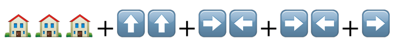
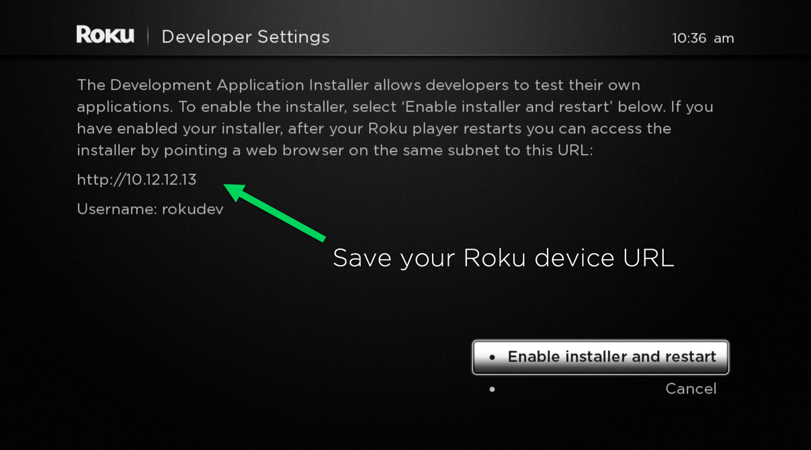
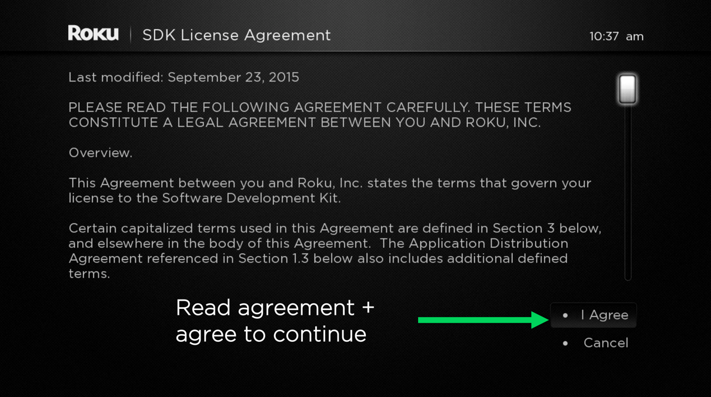
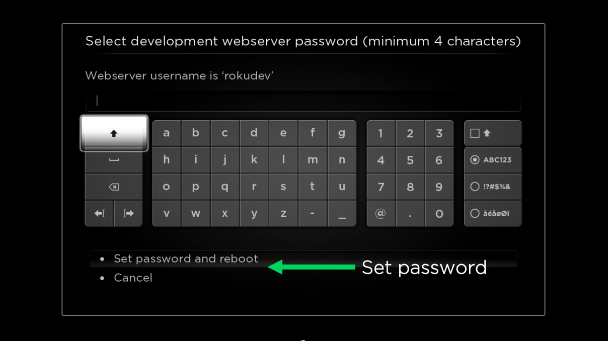
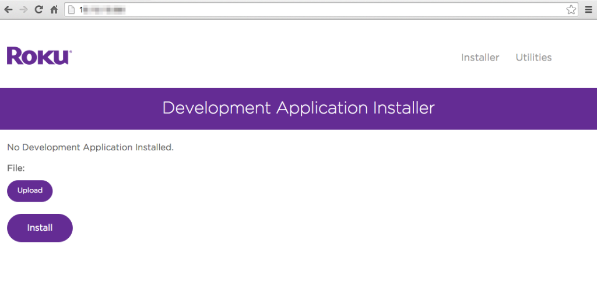

# Developer Setup Guide

### Overview

The first step to building channels on the Roku Platform is setting up a development environment. In this guide, we will cover the essential steps to enable **Developer Settings** on a Roku device.

**Steps:**

* Setup your Roku device to enable **Developer Settings**
* Accessing the Development Application Installer

**Requirements to follow this guide:**

* A Roku device: [roku.com/products/compare](https://www.roku.com/products/compare)
* A Roku account: [my.roku.com/signup](https://my.roku.com/signup)
* Enroll in the Developer Program: [developer.roku.com/enrollment/standard/](https://developer.roku.com/enrollment/standard/)

---

## 1. Setup your Roku device to enable Developer Settings

**Using your Roku remote (_or the Roku mobile app_), enter the following sequence:**

> :information_source: This sequence will also enable access to the Developer Application Installer, which allows you to test channel applications directly on your Roku device.

**Follow the steps provided in the following flow to enable Developer Settings:**

Once you begin this process, the dialog will prompt you to restart the device to continue to the process.

**Note:** Make sure to save the Roku device URL!

**After enabling the installer, review and complete the SDK License Agreement:**

You can review the full text at [docs.roku.com/doc/developersdk/en-us](https://docs.roku.com/doc/developersdk/en-us)

**The following prompt will ask to set a password for the Roku device:**

This ensures your device is protected on your local area network.

This completes the steps for enabling Developer Settings. Continue to the next section for loading applications onto the device.

## 2. Accessing the Development Application Installer

**After rebooting, open a web browser and enter the Roku device URL** (_i.e. http://192.168.x.x_)

**Once the page opens, you have successfully connected to your Roku device with Developer Settings enabled.**

The main screen will show the Development Application Installer:

## Next steps

Now that you have configured and enabled **Developer Settings** on your Roku device, it’s time to create a sample application.

Our introductory [Hello World Guide](/develop/getting-started/hello-world.md) offers a downloadable sample application for developing on the Roku Platform.

## After the Getting Started guides - explore the developer docs!

Go to [sdkdocs.roku.com](https://sdkdocs.roku.com/) and explore the methods, parameters, and syntax for building rich and complex channel applications on the Roku Platform.

For Roku SceneGraph, check out the [samples](/rokudev/sample-channels) and [tutorials](/develop/guides) on GitHub!
