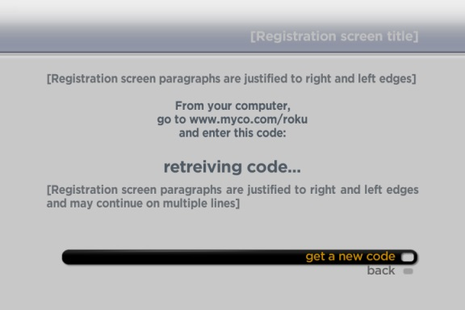
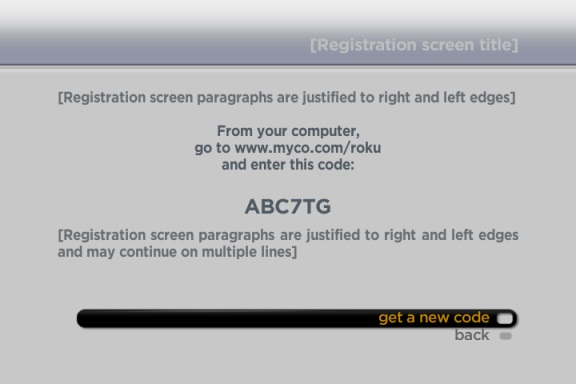

# Auth-Linking

## Overview

This document describes the typical flow and API used for registering and linking a device to a video service. The primary and recommended method for linking a device involves 3 main steps:

- (1) Generating a short on-screen registration code on the Roku device.
- (2) Having the user link the device by entering the registration code on the provider website.
- (3) Once the device detects that registration is complete, it displays a congratulations screen and allows the user access to the video service.

This is known as the "rendezvous" style of registration.

Several transactions between the device and the provider server make this work.
The steps are linked below, with each number representing one request/response transaction between device and server.

- (1a) First, the device makes a "pre-registration" request to the server.
- (1b) The server generates a short registration code and sets up an entry in a database associating the code with a temporary request for linking.
- (1c) The device receives this response and displays the code to the user.
- (2a) The device begins making a sequence of "link" requests to the server.
- (2b) The server responds to the link request with a "not completed" code until the user successfully enters the code into the web site, or the code expires.  -
- (3a) When the user has successfully entered the code plus any other necessary credentials on the provider web site, the server re-associates the code with the user's real account.
- (3b) The next time the device makes a "link" query, the server responds with a permanent token that can be used to access the user's account.

All subsequent API requests use this token to uniquely identify the customer and device. A request can be made as HTTP GET with values in parameters, or HTTP POST with values in the body of the request, for example, as XML or JSON.




## Resources

A corresponding sample channel and backend server was made to demonstrate how the "rendezvous" style of application flow works. WARNING: It shows all steps of the flow without inclusion of security measures for the sake of simplicity; use at your own discretion for a production level application.
- [**Server**](https://github.com/rokudev/auth-linking-server)
- [**Channel**](https://github.com/rokudev/auth-linking-channel)

## Step 1: Pre-Registration

This transaction is used to retrieve a registration code from the server for device registration.  The code is displayed on screen by the device and the user is requested to go to the website and enter this code.  It is desirable to make the code as short as possible to make it easy for the user to enter, yet ensure uniqueness during the retry interval.  The device will poll at a specified frequency (retryInterval) during registration until the device has been registered or the maximum time has expired (retryDuration). In the sample channel, a URL request is made by a roUrlTransfer to the server for a token, and the server responds with a token in JSON format.

**Pre-registration Request**

 ```
 <preRegistration>
 <deviceID> (unique id/serial number for the device) </deviceID>
 <deviceTypeID> (optional opaque string identifying device type) </deviceTypeID>
 <firmwareVersion> (optional major.minor.build) </firmwareVersion>
 </preRegistration>
```

**Response**

 ```
 <result>
 <status> success/failure </status>
 <regCode> (small ~5 character code customer will enter onto web site) </regCode>
 <retryInterval> (polling interval in secs to detect completion (e.g. 30) </retryInterval>
 <retryDuration> (max duration in secs for retries (e.g. 900) ) </retryDuration>
 </result>
 ```

## Step 2: Device Linking

This transaction is used to check the registration progress to see if the user has successfully entered their registration code on the website to link their device. This method is polled continuously at the specified interval (retryInterval) from the time the preregistration request is made until a success response is received or until the max retry time (retryDuration) has elapsed. An example of the request/response is shown below in XML format:

**Link Request**

 ```
 <linkAccount>
 <regCode> (current registration code from PreRegistration request) </regCode>
 <deviceID> (unique id/serial number for the device) </deviceID>
 <deviceTypeID> (opaque string identifying device type) </deviceTypeID>
 </linkAccount>
 ```

**Intermediate Response**
 ```
 <result>
 <status> incomplete </status>
 </result>
 ```

 The device linking request may fail for several reasons, such as:

 - Missing or invalid registration code
 - Expired registration code
 - Customer account issue (e.g. not registered, hold, etc.)

## Step 3: Linking Success

The final response after successfully linking the device will be a response with
the device's token. The deviceToken can then be used by the client to perform further
operations on the server, such as play media.  This token, and not the device
serial number, should be used to identify an account on the server.  This allows
a user to disassociate a device from an account (unlink) by simply removing the
channel which causes the stored device token to be discarded.

**Final Response**

 ```
 <result>
 <status> success/failure </status>
 <deviceToken> (opaque string to identify account for future requests) </deviceToken>
 <customerId> (optional customer ID if required by partner) </customerId>
 <creationTime> (optional ISO8601 date/time value) </creationTime>
 </result>
 ```
