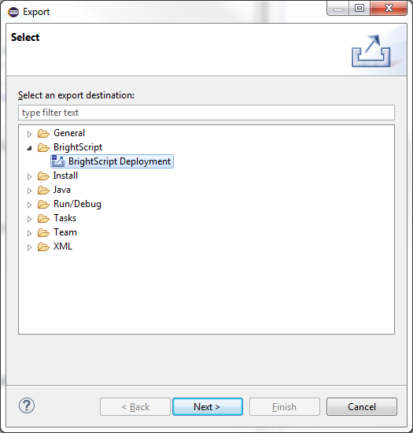
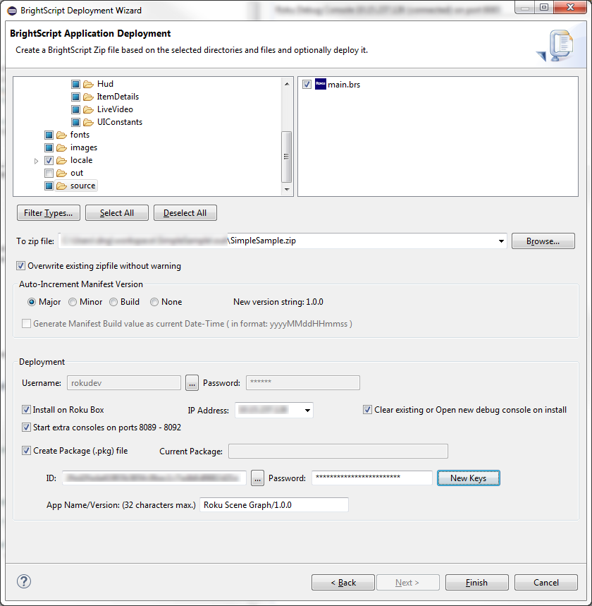
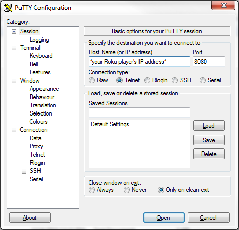
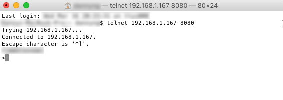
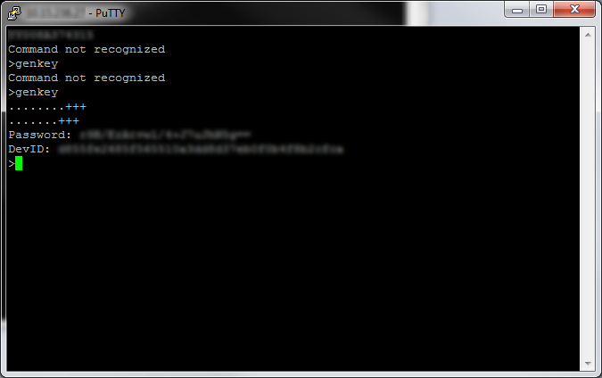
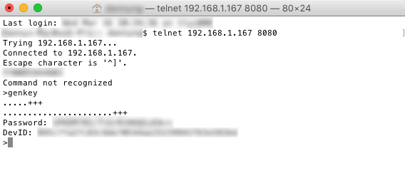
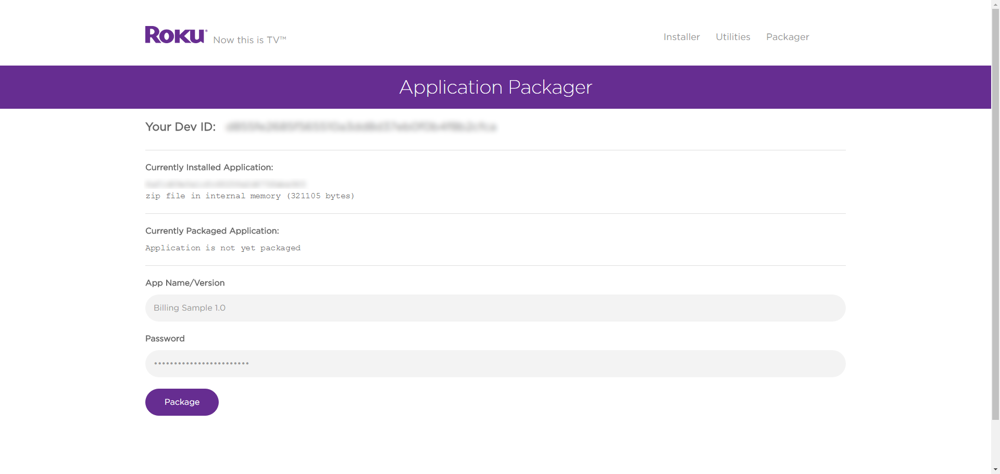
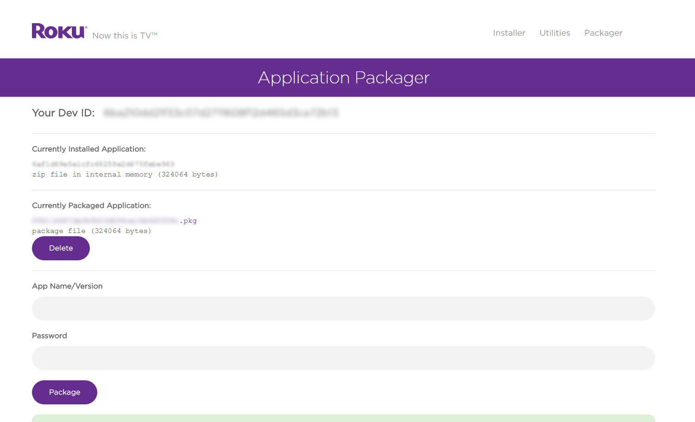
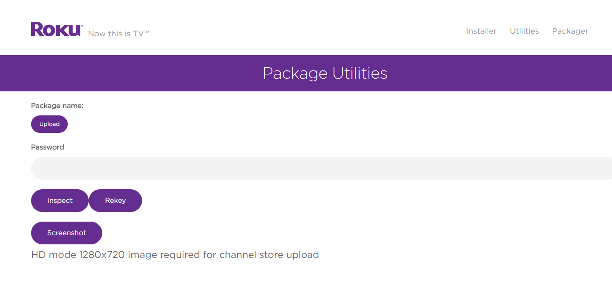
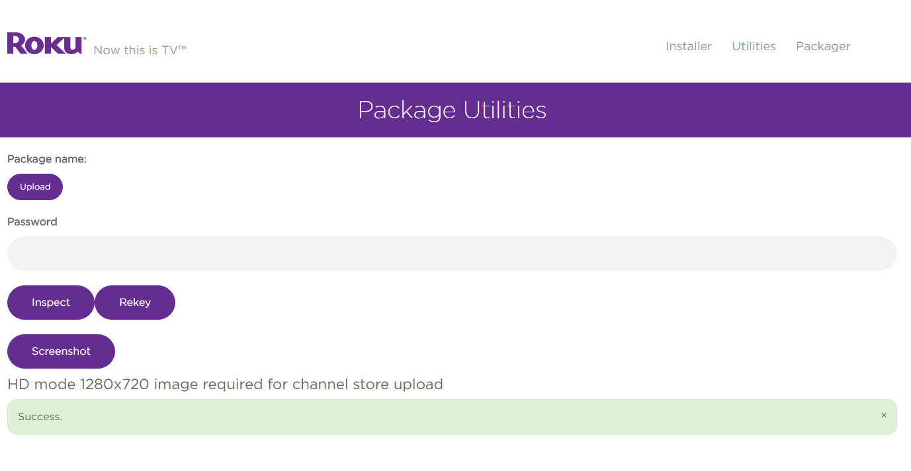

# Packaging Channels for Publication

## Overview

Publishing on the Roku Channel Store requires several core items — such as source code, images, and fonts — to be “packaged.” This enables developers to securely publish channels while keeping all intellectual property safely encrypted. The process of “packaging a channel” uses cryptographic hardware built into Roku devices and creates an encrypted package that can be easily and securely distributed on Roku devices.

**Sections:**

* [Packaging with Eclipse](#packaging-with-eclipse)
* [Packaging using the Package Utilities](#packaging-using-the-package-utilities)
 * A. [Install (or "side-load") channel on a Roku device](#a-install-or-side-load-channel-on-a-roku-device)
 * B. [Open a telnet session](#b-open-a-telnet-session)
 * C. [Run the genkey utility to create a signing key](#c-run-the-genkey-utility-to-create-a-signing-key)
 * D. [Packaging the side-loaded channel](#d-packaging-the-side-loaded-channel)
* [Rekeying](#rekeying)

## Packaging with Eclipse

Packaging can be done in Eclipse using the [Roku Plugin for Eclipse](/develop/developer-tools/eclipse-plugin.md).

In an existing BrightScript project, select `File > Export > BrightScript Deployment`.

In the following dialog, check `Install on Roku Box` and `Create Package (.pkg) file`.

If the genkey utility has not been run previously, click on `New Keys` to generate a signing key.

Select `Finish` and the package will be available in the `out` folder of the current BrightScript project in the Eclipse workspace.

## Packaging using the Package Utilities

### A. Install (or “side-load”) channel on a Roku device

In addition to the Eclipse plugin, developers can use the package utilities located within the Development Application Installer. Note that before a channel can be packaged, it must first be side-loaded onto a Roku device.

Refer to the [Hello World](/develop/getting-started/hello-world.md) Guide on how to side-load channels.

### B. Open a telnet session

Once you have the channel side-loaded onto a Roku device, you’ll need to generate a key to sign your package. Windows developers can use a telnet client such as [PuTTY](http://www.putty.org/), while OSX/Linux developers can use the built-in client through terminal.

**Windows**: In PuTTY, enter the `IP address` of your Roku player, `8080` for the port, and `Telnet` as the connection type.

**OSX/Linux**: Open terminal and type: `telnet <Roku-IP-address> 8080`

### C. Run the genkey utility to create a signing key

Type `genkey` into the command prompt/terminal and wait for the process to complete. If the prompt says “Command not recognized,” type it again.

Upon completion, a key has been successfully generated to sign packages. Make note of the developer ID and password as it’ll be required in the next step (and anytime code is updated and needs to be repackaged).

_Note: It is a good practice to generate a new signing key for each channel created unless you explicitly want to share registry information between channels._

### D. Packaging the side-loaded channel

Return to the Developer Application Installer. There should now be a `Packager` option available. If this option is not available, go through the previous step and run `genkey` again.

Click on `Packager` to bring up the Application Packager page. The Dev ID should match the same developer ID that was generated with genkey.

Enter an App Name and Version and enter the password created from the genkey utility.

Click on `Package` and a few short moments later the signed package can be downloaded using the `.pkg` link.

## Rekeying

When developing multiple applications, it’s good practice to sign each package with a different key. This ensures registry entries are not shared between channels. To sign different packages on the same device, it will have to be rekeyed.

On the Development Application Installer, select `Utilities`.

Click on `Upload` and select the signed package you'd like to use to rekey the player. Enter the `password` from genkey that matches the key used for the signed package and select `Rekey`.

A success message will be displayed when the process is complete.
