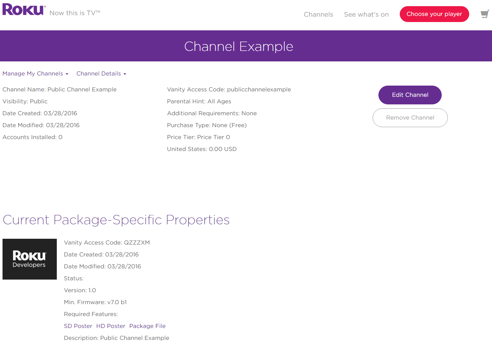

_Test your channels as private channels before publishing in the Channel Store_

## Overview
The Roku platform supports both public and private channels. Public channels are published in the Roku Channel Store and discoverable from the Search feature on the Roku home page. Private channels, however, are used for QA and beta testing purposes and can only be installed using the channel’s dedicated access code.

This post provides an overview of how private channels work.

**Sections:**
<ol>
 	<li ><a href="https://docs.google.com/document/d/1NR19CBVTnsU2JxCY-aEPWXEgKP_SLM9W7F0uNRienw4/edit#heading=h.t5udro5bg3k">Purpose of private channels</a></li>
 	<li ><a href="https://docs.google.com/document/d/1NR19CBVTnsU2JxCY-aEPWXEgKP_SLM9W7F0uNRienw4/edit#heading=h.dxr7yty6pcrd">Publishing a private channel</a></li>
 	<li ><a href="https://docs.google.com/document/d/1NR19CBVTnsU2JxCY-aEPWXEgKP_SLM9W7F0uNRienw4/edit#heading=h.njnk3e6fqv6n">Updating an existing channel</a></li>
 	<li ><a href="https://docs.google.com/document/d/1NR19CBVTnsU2JxCY-aEPWXEgKP_SLM9W7F0uNRienw4/edit#heading=h.pxhkoj2ik6rz">Installing private channels</a></li>
</ol>
## Purpose of private channels
### QA process
Private channels are for testing and staging your channels before submitting to begin the Roku Channel Store certification process. Given the hidden nature of private channels, they can be administered to QA testers without damaging the brand by having a bug-filled channel seen by the public.
### Auto-publishing
Private channels that do not use pay-to-install Roku Billing are exempt from the certification process. This enables developers to quickly test multiple revisions and bug patches without being blocked by certification’s wait time.
### Roku Billing testing
All in-channel products purchased before a developer has enrolled in Roku Billing Services are treated as $0.00 test transactions. Developers can use this feature to test that Roku Billing has been properly integrated without making excess money transfers or having to reimburse their testing team.
### Internal use
In some instances, private channels are used to distribute a finished channel to a dedicated group, such as a corporate training video or promotional videos displayed in retail stores.
### Small circulation
As stated, private channels are intended for small circulation — they are not designed for broad audience development. It is important to note that **a private channel that upgrades to a public channel will _not_ retain all of its previous downloads**. Roku users who’ve installed a private channel will need to re-download the channel once it is made public.

Developers should not attempt to grow their audience or promote their channel until after it has been made public.

## Publishing a private channel
To publish a private channel, start on the <a href="https://developer.roku.com/developer">**Developer Dashboard**</a> and select <a href="https://developer.roku.com/apps">**Manage My Channels**</a> followed by <a href="https://developer.roku.com/apps/create/private">**Add Private Channel**</a>.

Select the monetization method(s).

Fill out the channel properties:
<ul>
 	<li><b>Channel Stores:</b> Regions the channel will be available in. This does not apply to private channels.</li>
 	<li><b>Languages:</b> Languages to localize the Channel Store icons, descriptions and screenshots for</li>
 	<li><b>Required Features:</b>
 	<ul><li><b>USB Support:</b> Select this <b>only</b> if the channel requires a Roku with a USB port to function</li>
 	<li ><b>Screensaver:</b> Select this <b>only</b> if the channel is/contains a screensaver</li>
 	<li ><b>Roku Game Remote:</b> Select this <b>only</b> if the channel requires a remote with A &amp; B buttons to function</li>
</ul>
 	<li><b>Classification:</b> Select the option that best describes the channel type</li>
 	<li ><b>Internet Connection Required:</b> Yes/No</li>
 	<li ><b>Parental Hint:</b> Select the best rating for the content in the channel. If unsure, select _Content Not Rated_.</li>
 	<li ><b>Vanity Access Code:</b> Add a unique string of characters to make sharing the channel easier (ex. _https://my.roku.com/add/mychannel_). The vanity access code is only available after a channel has been published. <b>This code is the only way to download a private channel.</b></li>
</ul>

Next you’ll need to provide some information about the channel along with channel poster images for various resolutions.

Click **Continue** on the screenshots page, as screenshots can be omitted for private channels.

On the **Package Submission** page, **Select** the signed package for publication and click on **Save Changes**.

After the package has been uploaded, there should now be an **Access Code** available and the **Submit **button should also be selectable.

Select **Submit **to successfully publish the channel.

The package details will be shown on the right and the status will update to Published. Since private channels are not searchable in the Roku Channel Store, it is the developer’s own responsibility to share the channel access and/or vanity code(s) as desired.
## Updating an existing channel
Updating a channel follows many of the same steps as submitting a new channel. On the <a href="https://developer.roku.com/developer">**Developer Dashboard**</a>, select <a href="https://developer.roku.com/apps">**Manage My Channels**</a> and select the channel that needs to be updated.

If none of the Channel Properties or Descriptions need to be updated, click on **Edit Channel** to go directly to the **Package Submission** page.

On the **Package Submission** page, select:
<ul>
 	<li >Channel Version</li>
 	<li >Minimum firmware required to run the channel</li>
 	<li >Application Package: Select signed package for publication</li>
</ul>
and then click on **Save Changes**.

Be sure to increment the channel’s major, minor, and build versions in the manifest as well as on the Roku Developer Portal for each package submitted.

Remember that private channels do not go through Roku certification and will be auto-published if they do not use pay-to-install Roku Billing. Private channels using in-channel products can also be auto-published but purchases will remain as $0.00 test transactions.
## Installing private channels
Since private channels are not searchable in the Roku Channel Store, they can only be installed directly from their vanity access code URL. As stated above, a memorable vanity code can be provided during the channel publishing process, or you can use the random access code generated when the channel is published.

To install a channel using a vanity code:
<ul>
 	<li >Login to your Roku account</li>
 	<li >Enter https://my.roku.com/account/add?channel=[VANITY_CODE] into your browser</li>
 	<li >Replace [VANITY_CODE] with your channel’s access code</li>
 	<li >Click “Yes, Add Channel.”</li>
</ul>

Finally, you will need to update your Roku OS before the channel will appear in your home screen. To update your OS, launch your Roku device and navigate to Settings &gt; System &gt; System Update &gt; Check Now.
