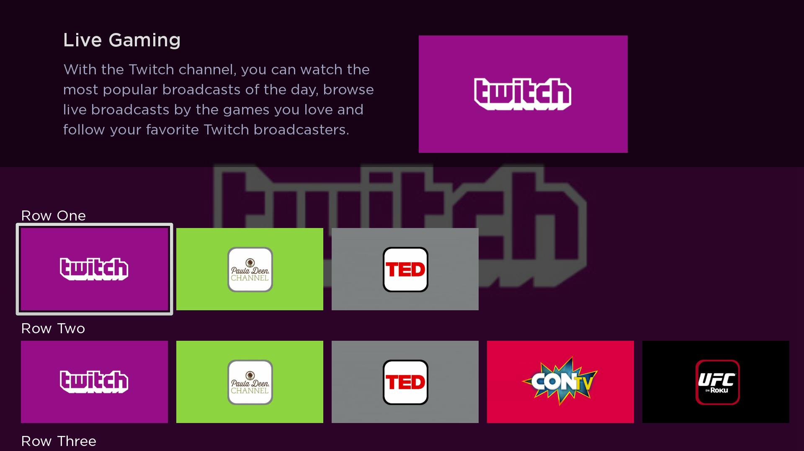
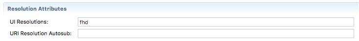

# Building a User Interface with Roku SceneGraph

This guide is a continuation from [parsing an XML feed](/develop/sdk-development/parsing-feed.md). In this guide we'll cover building a basic grid layout using SceneGraph.



The main steps include:

1. [Scaling for different resolutions](#1-scaling-for-different-resolutions)
2. [Setup the HomeScene](#2-setup-the-homescene)
3. [Create a grid using RowList](#3-create-a-grid-using-rowlist)
4. [Create a overhang banner](#4-create-a-overhang-banner)
5. [Populate the grid](#5-populate-the-grid)
6. [Update overhang banner](#6-update-overhang-banner)

## 1. Scaling for different resolutions

This example will be designed in FHD (1920x1080) resolution. To ensure the UI scales correctly across different resolutions, the `ui_resolutions` attribute will need to be added to the `manifest`.

In the [Roku Plugin for Eclipse](/develop/developer-tools/eclipse-plugin.md), open the manifest file and add `fhd` to `UI Resolutions` under `Resolution Attributes`.



If you're not using the Roku Plugin for Eclipse, open the `manifest` in a text editor and add:

```brightscript
ui_resolutions=fhd
```

## 2. Setup the HomeScene

We will setup a simple main thread to create our `Screen` object and our message port. The screen will be used to display our home scene for our UI and our message port will be used to listen for events such as a command to exit the channel. Below is the setup for the main thread. Simply create a `.brs` file in the source folder, name it `main.brs`, and use the code below.

> :information_source: `m` is a static variable

```brightscript
sub Main()
    screen = CreateObject("roSGScreen") ‘Create Screen object
    m.port = CreateObject("roMessagePort") ‘Create Message port
    screen.setMessagePort(m.port)‘Set message port to listen to screen

    scene = screen.CreateScene("HomeScene") ‘ Create HomeScene
    screen.show()

    while(true) ‘Listens to see if screen is closed
        msg = wait(0, m.port)
        msgType = type(msg)
        if msgType = "roSGScreenEvent"
            if msg.isScreenClosed() then return
        end if
    end while
end sub
```

## 3. Create a grid using RowList

In the `components` folder is where we will put all our SceneGraph components. Create a new `.xml` file inside the `components` folder and name it `HomeScene`. This will be where we setup our UI. All SceneGraph nodes written in the XML file must be within the `<children>` element.

SceneGraph judges the depth of its elements based off of where they are written inside your XML file. Nodes defined at the top of the XML file will be the furthest back while the bottom will be the nodes displayed at the front. First we will start by making a shaded background and a `RowList` to display on top of it.

> :information_source: Check the references below for the field definitions for each node.
* [Rectangle](https://sdkdocs.roku.com/display/sdkdoc/Rectangle)
* [RowList](https://sdkdocs.roku.com/display/sdkdoc/RowList)
* [Group](https://sdkdocs.roku.com/display/sdkdoc/Group)
* [Label](https://sdkdocs.roku.com/display/sdkdoc/Label)
* [Poster](https://sdkdocs.roku.com/display/sdkdoc/Poster)
* [Content Node](https://sdkdocs.roku.com/display/sdkdoc/ContentNode)
* [Scene](https://sdkdocs.roku.com/display/sdkdoc/Scene) (`HomeScene extends Scene`)

```xml
<!-- All nodes must be inside <children> headers -->
<children>
<!-- Shaded background behind the RowList -->
    <Rectangle
        id = "shader"
        height = "1080"
        width = "1920"
        color = "0x000000FF"
        opacity = "0.7"/>
<!-- RowList Node -->
    <RowList
        id= "RowList"
        translation= "[0,500]"
        itemComponentName= "PosterItem"
        numRows= "4"
        rowitemSize="[[351,197]]"
        rowItemSpacing= "[[20,0]]"
        itemSize= "[1920,270]"
        rowLabelOffset= "[[50,10]]"
        focusXOffset = "[50]"
        showRowLabel= "[true]"
        rowFocusAnimationStyle= "floatingfocus"
    />
```

## 4. Create a overhang banner

Next, we will make an overhang banner that displays the title, description, and artwork of the item being focused on from the `RowList`.

```xml
<!-- Shaded Overhang to display the focused content in the RowList-->
  <Rectangle
    id = "Overhang"
    height = "400"
    width = "1920"
    color = "0x000000FF"
    opacity = "0.5"
  />

<!-- Passed into a Group node to to make the formatting easier. All child nodes inherit the translation field of Group -->
  <Group
    translation = "[150,75]">
  <!--  Content title of the item focused. This label inherits translation from Group node -->
    <Label
      id = "Title"
      height = "30"
      width = "650"
      font = "font:LargeBoldSystemFont"/>
  <!-- Content description of the item focused . Also inherits translation from Group node -->
    <Label
      id = "Description"
      height = "250"
      width = "800"
      color = "0xA3A3C2FF"
      translation = "[0,75]"
      wrap = "true"/>
  <!-- Artwork of the item focused. Inherits translation of the Group node and adds onto the translation. Final translation on the screen is [150+850, 75+10] -->
    <Poster
      id = "Poster"
      height = "281"
      width = "500"
      loadWidth = "500"
      loadHeight = "281"
      loadDisplayMode = "scaleToFit"
      translation = "[850,10]"/>
  </Group>
```

## 5. Populate the grid

Now that all our nodes for the UI have been created, we need to populate them with content. This includes assigning the content from our XML feed to our `RowList` and setting the overhang to change based off the focused content in the `RowList`. This is most easily done in BrightScript. To keep our code clean, we will separate our BrightScript and XML in the HomeScene by pointing to a separate `.brs` file from our XML component.

```xml
<component name="HomeScene" extends="Scene">
    <script type = "text/brightscript" uri = "pkg:/components/HomeScene.brs" />
```

First create a BrightScript file named `HomeScene.brs` inside the `components` folder. This will be used for the BrightScript code. All SceneGraph nodes have the option of an `init()` function which will be called upon creation of the node. This is helpful for initializing variables, setting focus to an object, creating observer functions, and running a task node.

To start off in the BrightScript code, we have to reference all the SceneGraph nodes that we want to manipulate. These nodes are referenced by the IDs assigned to each node in the XML.

```brightscript
Sub init()
    m.RowList = m.top.findNode("RowList")
    m.Title = m.top.findNode("Title")
    m.Description = m.top.findNode("Description")
    m.Poster = m.top.findNode("Poster")
    ...
```

> :information_source: `m.top` is used to reference the `HomeScene` node as the BrightScript code belongs to the `HomeScene` node.

Next, set the focus to the `RowList` in `init()` so once the channel is launched, the user can scroll through the `RowList`. We will also create an instance named `LoadTask` for the task node we created to retrieve our XML feed and run it.

```brightscript
m.RowList.setFocus(true)
m.LoadTask = CreateObject("roSGNode", "SampleTaskNode") 'Create XML Parsing task node
m.LoadTask.control = "RUN" 'Run the task node
```

We can now set an observer that calls a function when a field is changed. In the [previous guide](/develop/sdk-development/parsing-feed.md), we created an interface field named `content` to store our content node. We can now assign it to our `RowList` from our `HomeScene`. In the line below, an observer is set to `LoadTask` to watch when the content field changes (after the task node has assigned the content node containing the XML to it).

```brightscript
m.LoadTask.observeField("content","rowListContentChanged")
```

Once the content field changes, it calls the function `rowListContentChanged()`

```brightscript
Sub rowListContentChanged()
     m.RowList.content = m.LoadTask.content
end Sub
```

This is done to make sure that the task node is finished before the content is assigned.

## 6. Update overhang banner

As a final step, we set an observer that changes the info in the overhang when the focus moves onto a new item in the `RowList`.

```brightscript
m.RowList.observeField("rowItemFocused", "changeContent")
```

This observer calls the function `changeContent()` whenever a new item is focused in the `RowList`.

```brightscript
Sub changeContent() 'Changes info to be displayed on the overhang
    contentItem = m.RowList.content.getChild(m.RowList.rowItemFocused[0]).getChild(m.RowList.rowItemFocused[1])
    'contentItem is a variable that points to (rowItemFocused[0]) which is the row, and rowItemFocused[1] which is the item index in the row

    m.top.backgroundUri = contentItem.HDPOSTERURL 'Sets Scene background to the image of the focused item
    m.Poster.uri = contentItem.HDPOSTERURL 'Sets overhang image to the image of the focused item
    m.Title.text = contentItem.TITLE 'Sets overhang title to the title of the focused item
    m.Description.text = contentItem.DESCRIPTION ' Sets overhang description to the description of the focused item
End Sub
```

Finally, we have our finished UI:


## Adding Video

Proceed to the next section for [adding video playback](/develop/sdk-development/video-playback.md) to this project.
