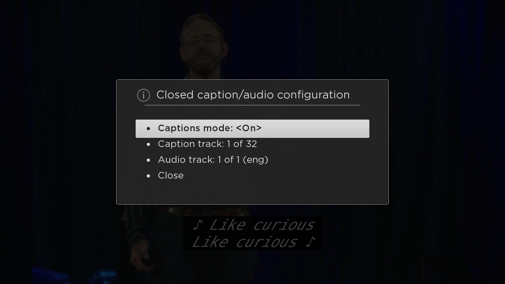

# Closed Caption & Subtitle Support
_Understand how captions and subtitles work in Roku Channels_



### Overview
Subtitles and closed captions are crucial to making your video content accessible to a bigger audience. These specifications will give you a quick overview of the supported formats on Roku devices, and how you can use them with Direct Publisher and SDK channels.

**Sections:**
* [Supported Formats](#supported-formats)
* [Closed Caption Support Summary](#closed-caption-support-summary)
* [SDK Channels](#sdk-channels)
* [Direct Publisher](#direct-publisher)
 * [Direct Publisher Feed](#direct-publisher-feed)
 * [MRSS Feed](#mrss-feed)
* [SMTPE-TT Support](#smtpe-tt-support)
 * [Structure](#structure)
 * [Styling](#styling)
 * [Layout](#layout)
 * [Timing](#timing)
* [Examples](#examples)

---

## Supported Formats
Roku devices support the following formats:

* **SMTPE-TT:** TTML formatted data either in an external file (`.ttml`) or embedded into the video stream. Roku devices support a subset of the full specification. See the [section](#smtpe-tt-support) below for more details.

* **EIA-608:** Roku supports EIA-608 closed caption data (analog TV format) encapsulated within a EIA-708 container (digital TV) in an H.264 elementary stream. EIA-608 captions are delivered as part of the video stream itself.

* **WebVTT:** Roku supports WebVTT captions if embedded in HLS streams or manifests (`.m3u8`).

* **SRT**

* **External Files:** For external subtitle files, the supported format extensions are: `.srt`, `.ttml`. Each closed captions language should correspond to a separate URL.

## Closed Caption Support Summary
Below you can find a quick summary of the closed caption formats supported for each streaming format:

|     | SMPTE-TT | EIA-608 | WebVTT |
| --- | -------- | ------- | ------ |
| **MP4 VOD** | Yes (external file only) | Yes (in stream only for all manifests containing AVC streams) | No
| **HLS VOD** | Yes (external file only) | Yes (in stream only for all manifests containing AVC streams) | Yes (in a separate stream described in the manifest ( playlist for HLS))
| **HLS Live** | No | Yes (in stream only for all manifests containing AVC streams) | Yes  (in a separate stream described in the manifest ( playlist for HLS))
| **Smooth VOD** | Yes (in stream or external file) | Yes (in stream only for all manifests containing AVC streams) | No
| **Smooth Live** | Yes (in stream only) | Yes (in stream only for all manifests containing AVC streams) | No
| **DASH VOD** | Yes (external file only) | Yes (in stream only for all manifests containing AVC streams) | No

## SDK Channels
External caption tracks can be passed in through content nodes to the video player. `SubtitleConfig` is an AssociativeArray containing captions from an external feed. The video node by default allows the user to select closed caption tracks when pressing the “options” key on the Roku remote. If the content doesn't contain captions, then “no captions or subtitles available” will be displayed. See `SubtitleConfig` in [Content Meta-Data](https://sdkdocs.roku.com/display/sdkdoc/Content+Meta-Data) for more details.

Example using a video node with external captions:

```brightscript
	Subtitle_config = {
		TrackName: “http://rokusample.com/captions.webvtt?10
}

vidContent = createObject(“roSGNode”, “ContentNode”)
vidContent.url = “http://video.rokusample.com/2341.m3u8”
vidContent.subtitleconfig = subtitle_config
vidContent.streamformat = “hls”
```

> :information_source: The feeds listed above are not real caption and video feeds

Also check out the [captions sample](https://github.com/rokudev/captions-sample) which demonstrates how to setup different caption formats in SceneGraph.

Closed captions can also be embedded into the video stream to contain caption text, timing, and format information. See [Examples](#examples) below for more info.

## Direct Publisher
When using Direct Publisher the closed caption information is described in your content feed. This is required if your stream uses external files, and they are not referenced in a manifest file. For embedded captions, there's no additional work required.

### Direct Publisher Feed
For more details on using captions in a Direct Publisher feed, see [Direct Publisher Feed Specification](https://github.com/rokudev/feed-specifications/blob/master/direct-publisher-feed-specification.md#caption).

**Example:**
```
{
  "url": "https://example.org/cdn/subtitles/1509428502952/sub-fr.srt",
  "Language": "fr",
  "captionType": "CLOSED_CAPTION"
}
```

### MRSS Feed
For more details on using captions in an MRSS feed, see [MRSS Feed Specification](https://github.com/rokudev/feed-specifications/blob/master/mrss-feed-specification.md#mediasubtitle).

**Example:**

```
<media:subTitle lang="en-us" href="http://www.example.org/cdn/subtitles/sub-en.srt" />
```

## SMTPE-TT Support

Roku's TTML parser will recognize regions, styles, and spans. The captions are recognized as `p` paragraph elements with a `begin` and `end` time. Roku's TTML does not recognized the `duration` attribute for captions.

Roku's Caption rendering will always use a built-in Gotham font regardless of any font specified in the TTML file. Likewise, font styles (like italics or Bold) are also ignored. However, the Roku Caption rendering will make a best guess effort at choosing the corresponding font size in the system Gotham font using the specifed font size in the TTML.

Roku's TTML parser recognizes sufficient stylings to render colors, positions, and alignments either on an absolute or percentage offset. Namespaces do not cause a problem for the parser, but they are not validated either.

### Structure

The Roku TTML parser recognizes the following elements from Section 7 of the TTML spec that specify the structure and principal content aspects of a document instance:

* [7.1.1 tt](http://www.w3.org/TR/ttaf1-dfxp/#document-structure-vocabulary-tt)
* [7.1.2 head](http://www.w3.org/TR/ttaf1-dfxp/#document-structure-vocabulary-head)
* [7.1.3 body](http://www.w3.org/TR/ttaf1-dfxp/#document-structure-vocabulary-body)
* [7.1.4 div](https://www.w3.org/TR/ttaf1-dfxp/#content-vocabulary-div)
* [7.1.5 p](https://www.w3.org/TR/ttaf1-dfxp/#content-vocabulary-p)
* [7.1.6 span](https://www.w3.org/TR/ttaf1-dfxp/#content-vocabulary-span)

### Styling

The Roku TTML parser recognizes the following elements from Section 8 of the TTML spec that specify the structure and principal styling aspects of a document instance:

* [8.1.1 styling](http://www.w3.org/TR/ttaf1-dfxp/#styling-vocabulary-styling)
* [8.1.2 style](http://www.w3.org/TR/ttaf1-dfxp/#styling-vocabulary-style)

The Roku TTML parser recognizes the following styling elements from Section 8.2 of the TTML spec:

* [8.2.2 backgroundColor](http://www.w3.org/TR/ttaf1-dfxp/#style-attribute-backgroundColor)
* [8.2.3 color](http://www.w3.org/TR/ttaf1-dfxp/#style-attribute-color)
* [8.2.6 displayAlign](http://www.w3.org/TR/ttaf1-dfxp/#style-attribute-displayAlign)
* [8.2.7 extent](http://www.w3.org/TR/ttaf1-dfxp/#style-attribute-extent)
* [8.2.9 fontSize](http://www.w3.org/TR/ttaf1-dfxp/#style-attribute-fontSize)
* [8.2.14 origin](http://www.w3.org/TR/ttaf1-dfxp/#style-attribute-origin)
* [8.2.18 textAlign](http://www.w3.org/TR/ttaf1-dfxp/#style-attribute-textAlign)

### Layout

The Roku TTML parser recognizes the following layout elements from Section 9 of the TTML spec:

* [9.1.1 layout](http://www.w3.org/TR/ttaf1-dfxp/#layout-vocabulary-layout)
* [9.1.2 region](http://www.w3.org/TR/ttaf1-dfxp/#layout-vocabulary-region)

### Timing

The Roku TTML parser recognizes the following basic timing attributes for use with timed elements:

* [10.2.1 begin](http://www.w3.org/TR/ttaf1-dfxp/#timing-attribute-begin)
* [10.2.2 end](http://www.w3.org/TR/ttaf1-dfxp/#timing-attribute-end)

---

## Examples

**Manifest file (.m3u8):** _master playlist with two video streams, and two subtitle tracks_

```
#EXTM3U

#EXT-X-MEDIA:TYPE=SUBTITLES,GROUP-ID="subs",NAME="English",DEFAULT=YES,AUTOSELECT=YES,FORCED=NO,LANGUAGE="eng",URI="http://example.org/video-sub-eng.m3u8"

#EXT-X-MEDIA:TYPE=SUBTITLES,GROUP-ID="subs",NAME="French",DEFAULT=NO,AUTOSELECT=YES,FORCED=NO,LANGUAGE="fra",URI="http://example.org/video-sub-fra.m3u8"

#EXT-X-STREAM-INF:PROGRAM-ID=1,BANDWIDTH=450560,RESOLUTION=480x352,SUBTITLES="subs"
http://example.org/video-1.m3u8

#EXT-X-STREAM-INF:PROGRAM-ID=1,BANDWIDTH=855040,RESOLUTION=480x352,SUBTITLES="subs"
http://example.org/video-2.m3u8
```

**Manifest file (.m3u8):** _WebVTT subtitle playlist (this could be the video-sub-eng.m3u8 referenced above):_

```
#EXTM3U

#EXT-X-TARGETDURATION:30
#EXT-X-VERSION:3
#EXT-X-MEDIA-SEQUENCE:0
#EXT-X-PLAYLIST-TYPE:VOD
#EXTINF:30,
englishSegment0.vtt
#EXTINF:30,
englishSegment1.vtt

#EXT-X-ENDLIST
```

**WebVTT**

```
X-TIMESTAMP-MAP=MPEGTS:900000, LOCAL:00:00:00.000

00:06:000 --> 00:09.000
Subtitles are fantastic!

00:12.700 --> 00:16.800
Indeed, they are beautiful.
```

**TTML**

```xml
<?xml version='1.0' encoding='UTF-8'?>
<tt xmlns='http://www.w3.org/ns/ttml' xml:lang='en' >
  <body>
    <div>
      <p begin="00:00:01.878" end="00:00:05.334" >Subtitles are fantastic!</p>
      <p begin="00:00:08.608" end="00:00:15.296" >Indeed, they are beautiful.</p>
    </div>
  </body>
</tt>
```

---

**Related Resources:**
* [Captions Sample](https://github.com/rokudev/captions-sample)
* [W3C - WebVTT Format](https://w3c.github.io/webvtt/)
* [W3C - TTML Format](https://www.w3.org/TR/ttaf1-dfxp/)
