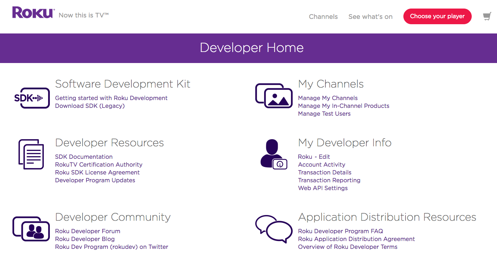
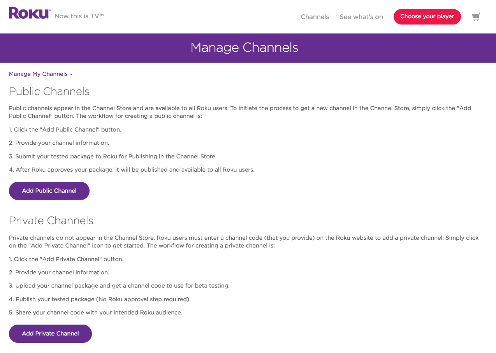
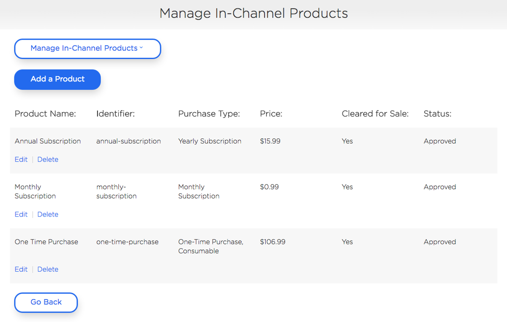
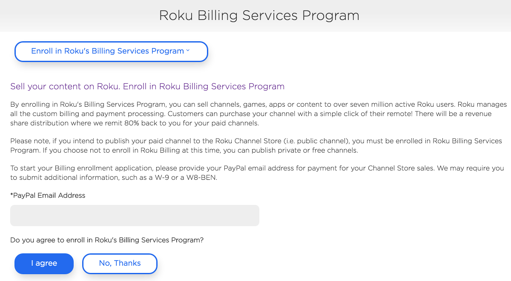
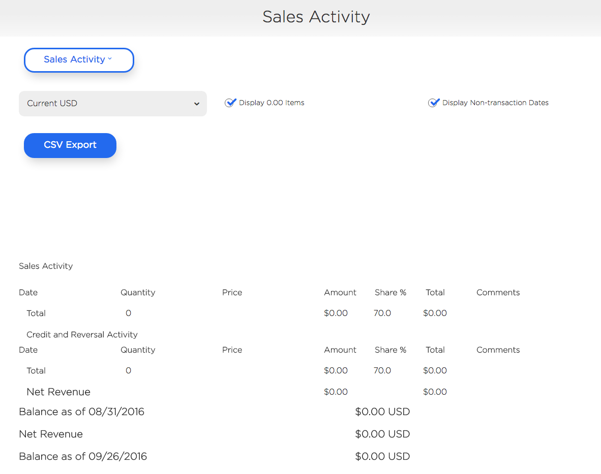
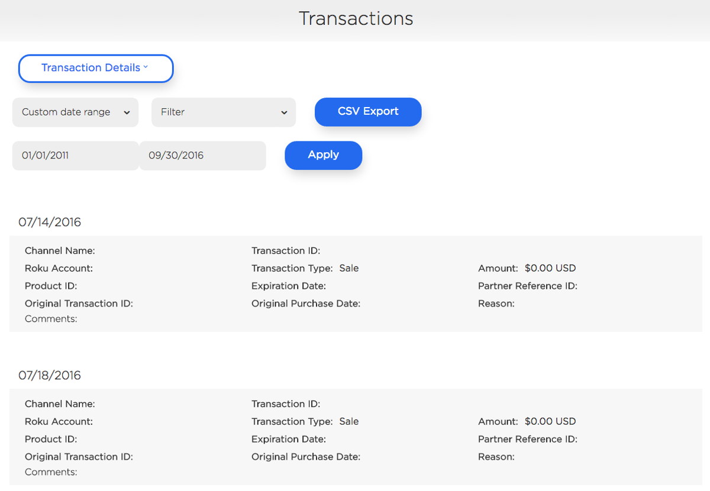
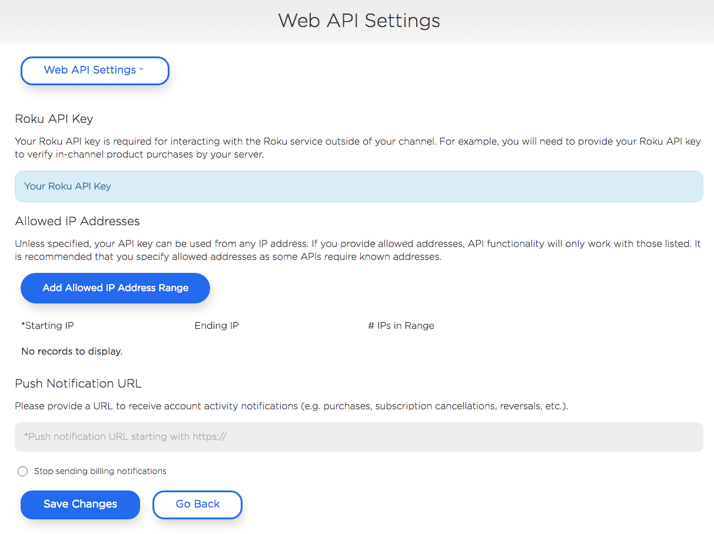

# Developer Dashboard
_Managing channels, products, test users, and analytics_

### Overview

The **[Developer Dashboard](https://developer.roku.com/developer)** contains many useful features such as submitting and updating channels, managing test users, and a assortment of analytics and reports for transactions made through Roku Billing Services.

**Sections:**
* [My Channels](#my-channels)
  * [Manage Channels](#manage-channels)
  * [Manage In-Channel Products](#manage-in-channel-products)
  * [Manage Test Users](#manage-test-users)
* [Developer Info](#developer-info)
  * [Account Activity](#account-activity)
  * [Transaction Details](#transaction-details)
  * [Transaction Reporting](#transaction-reporting)
  * [Web API Settings](#web-api-settings)
* [Developer Resources](#developer-resources)

---

## My Channels

The My Channels section of the Developer Dashboard allows developers to submit or update Roku channels, create and edit Roku Billing products, and manage test users.

### Manage Channels

Public channels, private channels, and subsequent channel updates are submitted through this page on the Developer Dashboard.

See [Channel Publishing](/publish/channel-store/publishing.md) for more information.

### Manage In-Channel Products

This page enables developers to add new products for purchases in channels using Roku Billing. Products can be associated with one or more channels. For an overview on in-channel products, see the guide on [Roku Billing](/develop/guides/roku-billing.md).

> :information_source: This page is only available after enrolling in [Roku Billing Services](/publish/monetization/billing.md).

### Manage Test Users

This page enables developers to add Roku accounts as test users for channels. A valid payment method is required but purchases will not be charged.

To add a test user, simply enter the email for an existing Roku account and select the channel(s) that account should be a test user for.

> :information_source: This page is only available after enrolling in [Roku Billing Services](/publish/monetization/billing.md).

## Developer Info

The Developer Info section contains a host of essential tools for Roku Billing Services such as analytics and reports for overall channel revenue, individual transaction details, and managing settings for communicating with the Roku Web Services API for push notifications.

Information such as the developer name displayed in the Channel Store, name and address, and PayPal address can be edited by clicking on the [name - Edit](https://developer.roku.com/enrollment/standard/edit) link.

**Roku Billing Enrollment:**

Enrolling in Roku Billing Services is quick, simple, and only requires a PayPal email address (for remittances) and one of the following IRS forms:
* United States: (W-9): https://www.irs.gov/pub/irs-pdf/fw9.pdf
* Foreign (W-8BEN): https://www.irs.gov/pub/irs-pdf/fw8ben.pdf

The required IRS form request will be sent in a follow-up email from [enrollment@roku.com]().

---
> :information_source: This following options are only available after enrolling in [Roku Billing Services](/publish/monetization/billing.md).

---

### Account Activity

Account Activity provides an overall sales report on each channel containing revenue earned through Roku Billing Services. Each report provides information such as total number of sales, the amount earned, and net revenue.

### Transaction Details

Transaction Details provides information for each transaction completed through Roku Billing Services in your channel(s). Each transaction contains details such as:
* a Roku Account number unique to the user and channel
* Product ID (specified when the in-channel product was created)
* name of the channel the transaction was completed in
* original and subsequent transaction IDs
* the type of transaction and amount and currency
* original and current transaction date
* a reason the transaction occurred and any related comments

### Transaction Reporting

Transaction Details reports can also be requested on the Transaction Reporting page. This is useful for larger reports that may take some time to generate. Once the report is done processing, it can be downloaded as a `.csv` file. The most recently ran reports will also be saved on this page.

### Web API Settings

This page enables developers to setup a location to receive push notifications for Roku-billed transactions such as credits, sales, refunds, and cancellations.

Refer to the [Roku Web Services](/develop/guides/roku-web-services.md) guide for more information.

## Developer Resources

The Developer Dashboard also contains links to useful resources such as [Getting Started with developing on Roku](/develop/getting-started), [API references](sdkdocs.roku.com), and the Roku [Forum](https://forums.roku.com/), [Developer Blog](https://blog.roku.com/developer/), and [Roku Developer Twitter account](https://twitter.com/rokudev).
