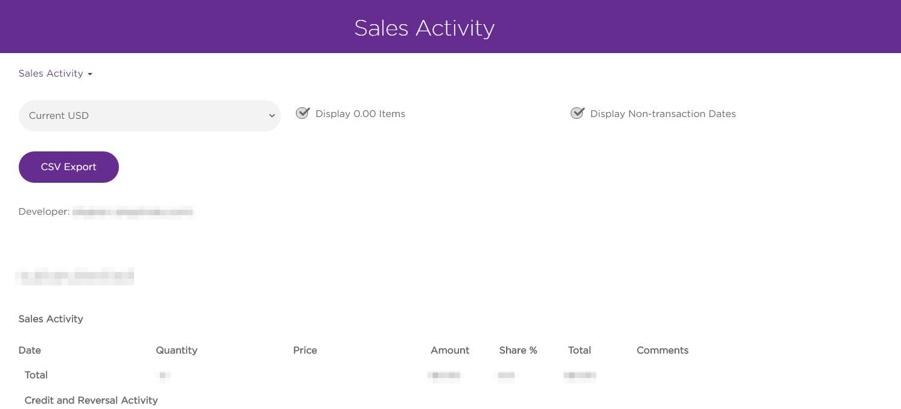

# Monetization

*How to monetize on the Roku platform*

### Overview
There are several primary ways to directly monetize your channel and grow a passionate viewing audience. Review the following sections to learn more:

## [Advertising](/publish/monetization/advertising.md)

Channels can deliver more effective advertising to their audience with our suite of tools and services optimized for TV streaming. In addition, Roku OS has new opportunities for brands to connect with next-generation TV viewers.

## [Purchases](/publish/monetization/purchases.md)

Roku's cloud infrastructure enables payment processing for all channels on the Roku platform. It enables publishers to integrate directly with our billing infrastructure, reducing customer support costs and effectively monetize channels. With the majority of Roku customers having payment info on record, this presents a great opportunity to monetize through purchases.

## [Payments](/publish/monetization/payments.md)

A primary goal for the Roku Publishing Platform is sharing revenue with our channel developers. With the majority of our customers having up to date payment details, there is a major opportunity for publishers to monetize their audience.
