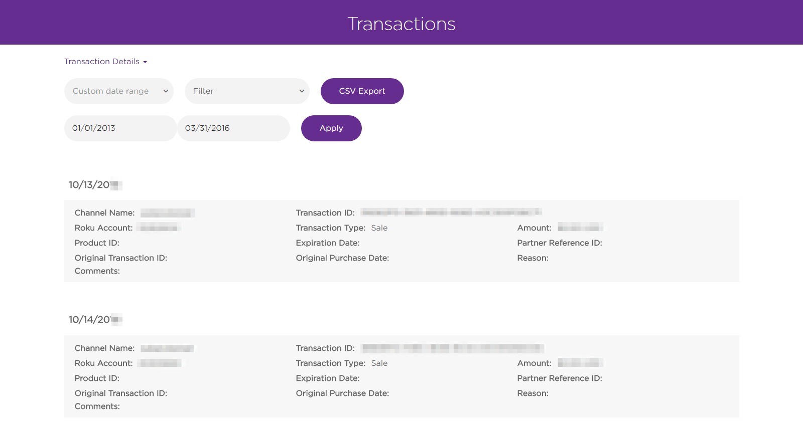
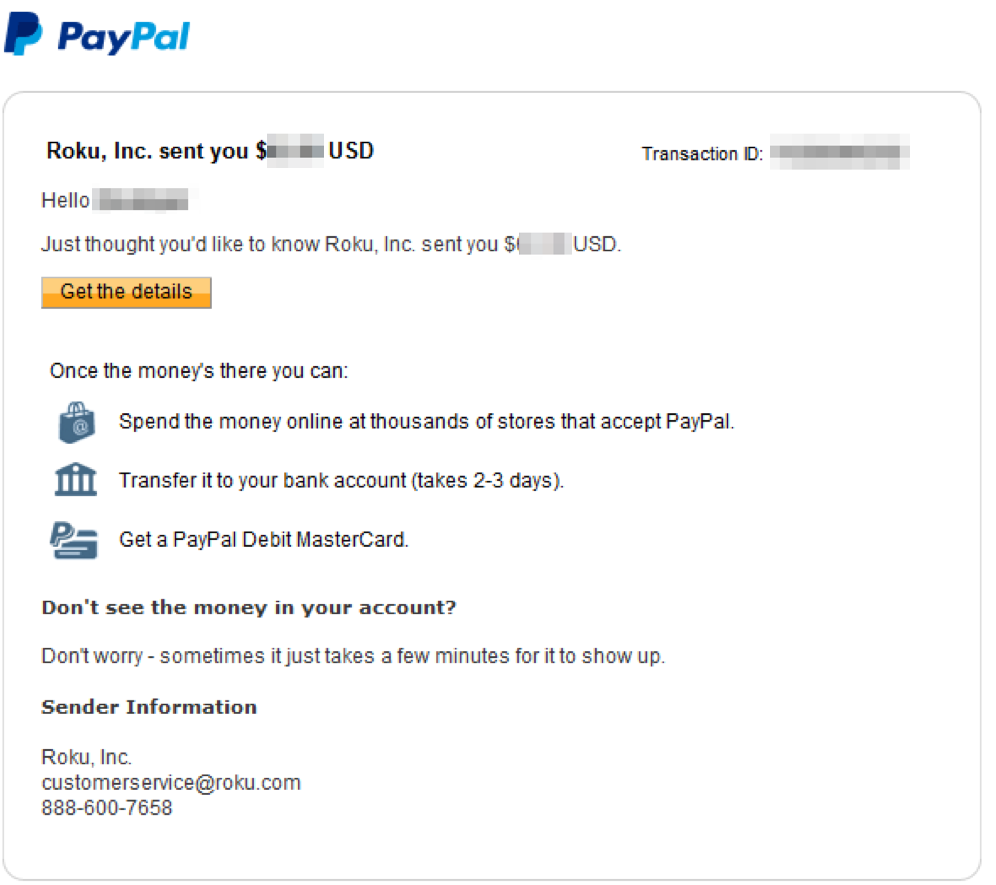

# Payments

_Revenue shares, disbursements, tax forms, and more for channels_

### Overview

A primary goal for the Roku publishing platform is sharing revenue with our channel developers. With the majority of our customers having up to date payment details, there is a major opportunity for publishers to monetize their audience.

To sign up for Roku Billing Services:

1. Create a Roku customer account: [my.roku.com/signup](https://my.roku.com/signup)
2. A Roku developer account: [developer.roku.com/enrollment/standard](https://developer.roku.com/enrollment/standard)
3. Enroll in Billing services: [developer.roku.com/enrollment/billing](https://developer.roku.com/enrollment/billing)

> :information_source: For purchasing and payments, Roku’s revenue share program is 20% of revenue received (net of credits, refunds, etc.) for channels.

**Sections:**

* [Sales Activity reports](#sales-activity-reports)
* [transaction details](#transaction-details)
* [Developer payments](#developer-payments)
* [Supported currencies](#supported-currencies)

---

## Key Features

The following tools and reports help developers get the most out of transactions through Roku's platform:

### Sales Activity reports
https://developer.roku.com/reports

Developers can view all recent channel payments and purchases from their channels. The sales info can also be exported into a `.csv` file as tabular data.

### Transaction details
https://developer.roku.com/transactions

Full list of transactions for channels including individual purchases, amounts, and dates for those items.

### Developer payments
Remittances are delivered through Paypal.

### Supported currencies

Roku Billing is offered in all Channel Store regions. Customer purchases and developer payments are made in the currency types listed below:

<table>
<tr><th>Country</th><th>Currency</th></tr>
<tr><td>United States</td><td>USD</td></tr>
<tr><td>Mexico</td><td>USD</td></tr>
<tr><td>Canada</td><td>CAD</td></tr>
<tr><td>United Kingdom</td><td>GBP</td></tr>
<tr><td>Ireland</td><td>EUR</td></tr>
<tr><td>France</td><td>EUR</td></tr>
<tr><td>Rest of World</td><td>EUR</td></tr>
</table>

> :information_source: When your Paypal account receives currencies listed above, Paypal offers conversion options for your preferred currency (fees may apply). [More info on Paypal currencies](https://www.paypal.com/us/cgi-bin/webscr?cmd=p/sell/mc/mc_receive-outside).

To learn more about purchases on the Roku publishing platform, [click here](/publish/monetization/purchases.md).
