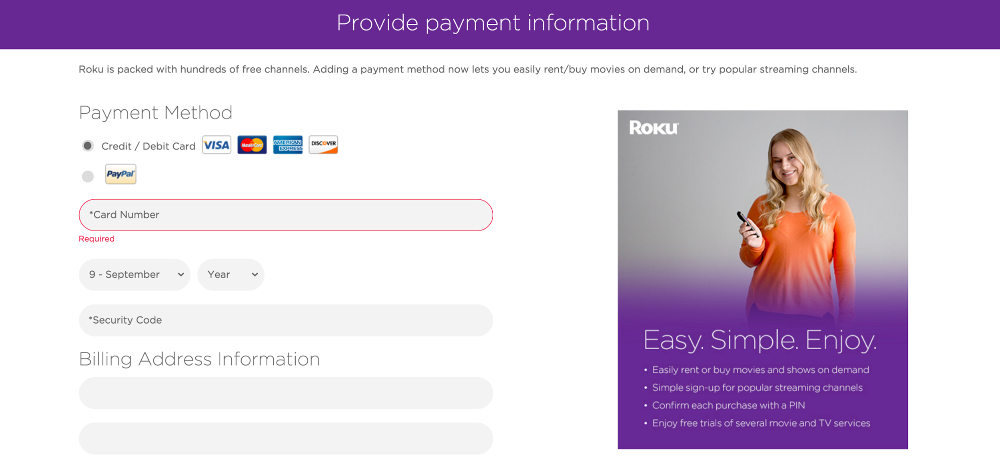
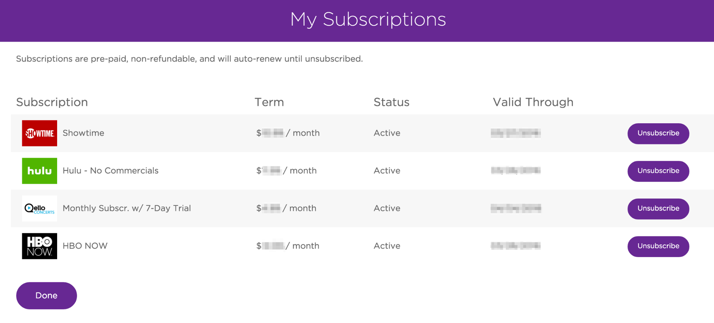
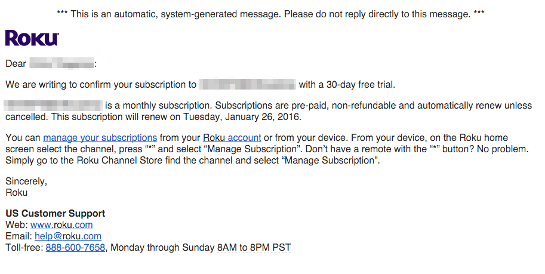

# Purchases

### Overview

Roku's cloud infrastructure enables payment processing for all channels on the Roku platform. It enables publishers to integrate directly with our billing infrastructure, reducing customer support costs and effectively monetize channels. With the majority of Roku customers having payment info on record, this presents a great opportunity to monetize through purchases.

To sign up for Roku Billing Services:

1. Create a Roku customer account: [my.roku.com/signup](https://my.roku.com/signup)
2. A Roku developer account: [developer.roku.com/enrollment/standard](https://developer.roku.com/enrollment/standard)
3. Enroll in Billing services: [developer.roku.com/enrollment/billing](https://developer.roku.com/enrollment/billing)

*Roku's Publishing Platform offers two pricing models:*

**Pay-to-install**: Simple to setup and useful for specific types of applications such as themes and screensavers.

**In-channel purchases**: Great for allowing users to preview offerings without committing beforehand. This model also grants additional features such as free trials and multiple purchasing options per channel.

**Features:**

* [Customer payment details](#customer-payment-details)
* [Subscription management](#subscription-management)
* [Customer invoices](#customer-invoices)
* [Developer APIs](#developer-apis)

---

## Features
Roku handles many operations and transactional processing to minimize the number of services a developer would need to host using a third party system.

The core services include:

### Customer payment details
Customers have billing information stored securely with Roku. Payment information is not shared between parties and developers only need to prompt for payment and customers only need to authorize payments.

### Subscription management
https://my.roku.com/account/subscriptions

Customers can view all active subscriptions in addition to unsubscribing from services.

### Customer invoices

Purchase details are sent to customers directly from Roku via email.

## Developer APIs

For channel developers, purchase and transactions can be verified and processed through our [Web Services API](/develop/guides/roku-web-services.md), [roChannelStore](https://sdkdocs.roku.com/display/sdkdoc/roChannelStore), and [ChannelStore node](https://sdkdocs.roku.com/display/sdkdoc/ChannelStore) components.

This enables channels to run essential functions for purchases such as:

* Getting product catalogs
* Getting user purchases
* Processing purchases
* Requesting user info
* Account creation

For a step by step guide on Roku purchases and billing services inside a sample channel, [follow our Billing guide here](/develop/guides/roku-billing.md).
